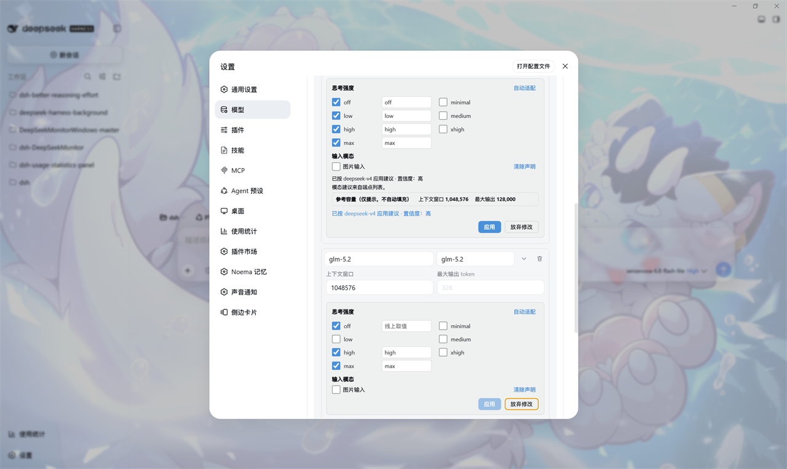

# DSH Better Reasoning Effort

<p align="center">
  <picture>
    <source media="(prefers-color-scheme: dark)" srcset="docs/banner-dark.svg">
    
  </picture>
</p>

[](LICENSE)
[](https://www.npmjs.com/package/dsh-better-reasoning-effort)
[](https://www.npmjs.com/package/dsh-better-reasoning-effort)


[](https://awesome-dsh-plugin.com)

**English** | [中文](README.zh.md)

Reasoning-effort **and input-modality** editing for **third-party models** in DeepSeek Harness, edited right inside the official Models page card — plus a quick reasoning-effort slider inside the official composer model menu (adapted from [HanaAyane's dsh-reasoning-effort](https://github.com/HanaAyane/dsh-reasoning-effort), see [Acknowledgements](#acknowledgements)).

<p align="center">
  
</p>

<p align="center">
  
</p>

## Why

The `llm-pi-ai` adapter natively supports per-model `reasoningEfforts` and `input` declarations, but the official Models page editor deliberately keeps both fields out of reach. As a result, third-party models get **no thinking-level picker** in the composer, only the official DeepSeek API can set reasoning effort, hand-declared models are treated as **text-only**, and configuring any of this meant hand-writing `settings.yaml` blocks. This plugin brings both configuration surfaces back into the UI: edit inside the official model editor card, plus one-click auto-adapt.

## Features

- **In-page injection**: an editor block appears in the official Models page under each model row's disclosure, next to context window / max tokens — not a separate settings page, but part of the official editing flow (same `settings.mutate` contract, same save style). The block spans the full row; its level rows split into the same two columns as the official capacity pair. It now carries two sections — **Reasoning effort** and **Input modalities** — whose changes commit with the official card's own **Save**, with the editor's **Reset** underneath them.
- **Pending until you save the card (zero writes while editing)**: the editor also appears on rows that are not saved yet, through one pipeline for two shapes — a provider's create card (auto-adapt reads the typed protocol/endpoint straight off the card), and a **new model row added under an already-saved provider** (auto-adapt then works from the stored route facts plus the display name typed on the row). **A change is pending the moment you make it**, and it lands together with your **Save** in that card — the official card freezes its own settings revision while it is open, so this plugin commits on the same Save instead of racing it (the "configured it, saved it, and it is gone" report). **Cancel** (or a reload) discards it together with the card's own fields. A declaration already in the document is never overwritten. Note staging cannot express a deliberate "unset": applying an all-clear draft simply withdraws the staging and lets host auto-fill fill its suggestion back in — to declare nothing durably, save the row first, then clear every level and Save.
- **Input-modality declaration**: one checkbox ("Image input") turns a hand-declared model vision-capable end to end — composer attachments, the read-image tool, and proxy gating all key off the same flag. Unchecking narrows the declaration to text-only; clearing it writes a durable `inputUnset` marker that host auto-fill respects, exactly like its reasoning-efforts sibling. On kernels whose official Models page already ships its own **Input-types** editor (`0.1.6-alpha.2`+), this section self-disables so there is exactly one modality surface — the capability is sniffed from the row DOM, never from a version number; older kernels keep it.
- **Endpoint-compatibility controls**: the editor carries a third section, rendered only on the protocol whose compat gate takes it. On `openai-completions` routes: the **thinking budget field** (which parameter carries the thinking-token budget — some vLLM / self-hosted endpoints read `thinking_token_budget`, others `thinking_budget` or `thinking_budget_tokens`; unset sends none) and the **vLLM priority** (scheduler priority for endpoints started with `--priority`). On `openai-responses` routes: **max_output_tokens in requests** — some Responses gateways reject the parameter, so "Omit it" keeps an output cap out of the request entirely. Controls use the official field shape (caption above, the official enum width, a hint line below) and each one says what it does. These switches are per-endpoint passthroughs, not model facts: the knowledge base deliberately never predicts them (no model is *known* to reject `max_output_tokens`), so Auto-adapt will not fill them — set them once for a gateway that needs them. Picking "Unset" and saving the card really removes the key again rather than keeping the last choice; the editor only ever deletes the fields it showed, so a compat field you wrote into `settings.yaml` by hand stays put.
- **Zoned suggestion display**: Auto-adapt reports what it applied (source · confidence) on its own line, says where modality advice came from (endpoint listing / knowledge base / name heuristic — the last one explicitly flagged low-confidence), and renders reference capacities (context window, max output) in a separate read-only block marked "hints only, never auto-filled". Values are thousands-grouped so you can copy them straight into the official capacity inputs by hand.
- **Auto-adapt**: a built-in model knowledge base (DeepSeek V3/V4/R1 with its vision experiment — re-checked 2026-09, when the current official ids became **deepseek-flash** = V4.1-Flash and **deepseek-v4-pro** = V4-Pro-0813, the older v4 spellings being compatibility aliases; the official enumeration is Off / low / high / max with high as default; plus dedicated entries for GPT-6 Astra — which rejects `none` with a 400 — and GPT-5.6-cyber; OpenAI GPT-4o/GPT-4.1/GPT-5.1–5.6 by generation including the codex variants, the o-series, the gpt-oss open weights and the non-reasoning `-chat` lines; Claude 3.x/4.5–5 with per-generation effort ladders (only the models Anthropic officially lists as effort-capable get one), Gemini, Grok 4.3–4.7, Mistral Small 2603 / Medium 3-5 (the reasoning_effort models; the deprecated magistral line declares no effort control), Qwen incl. Qwen-VL/QvQ and the 3.8 generation, GLM incl. GLM-4V/4.5V/4.6V/5V and GLM-5.2/5.3, Kimi K2.5/K2.6/K2.7-Code/K3, MiniMax M3's thinking toggle, Xiaomi MiMo v2.5/v2.6 (v2.5-pro is the text-only member), Doubao, Hunyuan hy3, Step incl. 3.5/3.6/3.7 and the Step-5-Preview generation, Baidu ERNIE (no effort control on the official surface) — every entry re-verified against each vendor's official docs in 2026-08 and cross-checked against the public OpenRouter catalog, with the 2026-09 additions (DeepSeek V4.1-Flash, Step-5-Preview, MiMo v2.5–2.6) read from official docs and Grok 4.7 from the public catalogs, because xAI's docs site was unreachable that pass (its entry says so); vision-capable variants carry their own entries so the base stem never claims images for them) plus protocol inference keyed by pi-ai's real wire protocols (`openai-completions` / `openai-responses` / `anthropic-messages`, plus a DeepSeek endpoint dialect from `baseURL` — only `api.deepseek.com`, the verified official host) fills recommended levels and wire spellings in one click. Families whose endpoints expose no effort-style control reachable here (Llama, Nova, Phi, Cohere, Perplexity sonar) deliberately carry no entry — the low-confidence generic suggestion is more honest. Compat suggestions are gated per protocol: the openai-completions gate takes thinkingFormat/supportsReasoningEffort, and adaptive-thinking Claude families on anthropic-messages routes get the `forceAdaptiveThinking` pin that makes pi-ai dispatch their declared efforts as `output_config.effort`.
- **Endpoint evidence**: Auto-adapt also probes the provider's RAW `/models` listing through a same-origin host route (credential resolved server-side, never echoed) and fuses the signal by confidence — an explicit "does not reason" wins outright; knowledge-base wire values stay authoritative; every suggestion is labeled high / medium / low so you know what to double-check. The same probe reads **modality disclosures** (OpenRouter-style `architecture.input_modalities`, models.dev-style nesting, `supported_features`/`capabilities` vision flags, `supports_vision`/`supports_images`) and the advertised **context length**; an explicit listing outranks the knowledge base, silence changes nothing — and an explicit `false` is an answer too: it strips the image claim the knowledge base would have made, so a gateway that fills the flag as a plain non-optional boolean instead of omitting it drops image input for models that do accept it. The probe mirrors the harness's own model discovery, unchanged from the `0.1.2-rc.1` kernel through `0.1.6-alpha.2`: it interrogates the same protocol set (OpenAI-compatible and, newly, **Anthropic Messages** — its native `/v1/models` route with `x-api-key` plus the fixed `anthropic-version`), accepts the enriched `models`-map listing shape alongside the standard `data` array, carries the provider profile's configured request headers (a resolved credential still wins its name), and applies the same 4 MB listing ceiling — deployments that authenticate through a custom header now probe as cleanly as they list. The harness's own attribution headers are deliberately not sent: this is a same-origin diagnostic, not a harness request.
- **Auto-fill (kept clear of the editing window)**: at boot, models without a `reasoningEfforts` declaration get a recommended one — and missing input-modality declarations are filled too (opt out via `modalityAutofill: false`; declared parts, explicit `false`, and deliberately unset markers are never touched, and capacities are never written at all). Models added during a session are filled by the browser half, and only once you have left the editing card; the write is optimistic-locked, so it never fights you for the write.
- **Three intents**: all levels off = unset the declaration (back to inheritance — persisted as a `reasoningEffortsUnset` marker so auto-fill respects it, even across restarts); only `off` armed = disable reasoning (`false`); levels armed = write the declaration. The editor stays in sync with official-page re-renders and pushed settings changes without clobbering your in-flight edits.
- **Composer reasoning-effort slider (full popover replication)**: when the official model menu (the bottom-right seat's popover) opens, its body is replaced on the same painted frame by the upstream design — the slider (white round thumb, gradient pill track, radiation canvas + flare; levels from the current model's adapter-advertised ladder) with 14px padding, a separator, and ONE model row reading *name · current effort ›* whose click opens the official model list. The official "Effort" drill-in row is gone because the slider IS the effort control; the official menu shell and the bottom-right trigger stay untouched. Dragging commits through the official session model-selection seam (optimistic, rolled back on refusal); a refused selection announces in the menu. Models with fewer than two levels show the quiet hint plus the model row. The replica mounts synchronously with the menu, so no official window flashes first. Model switches keep your level: a switch submitted without an explicit effort re-applies the level you picked **in this session** — which outranks everything for the session's life — else the model's configured default effort, else the level you last picked for that model (remembered per provider/model id), else the vendor's documented default from the knowledge base, in the same atomic commit so no "Default" state flashes in between (gated by the slider toggle; a model without the level on its ladder stays on the official default). Brand-new sessions and session restores land on the same chain through the projection watcher, wired from the session's birth — not from the first time the model menu opens.
- **Composer model search (unconditional)**: while the official model menu shows its model list, a search box is injected above the list. It filters the official rows by provider name, model name and model id (space-separated tokens, case-insensitive), hides provider groups with no match, and shows an empty state when nothing matches. `↓` from the input jumps to the first match, `Esc` clears the query, and while a query is active the arrow keys move between the **visible** rows only. It sits above the official list but below the official load notices, and it never touches the menu's own size or scrolling. Unlike the slider it is **not** behind the settings toggle: it is injected whenever the plugin is active.
- **Per-model default effort (issue #4)**: each model row's editor gains a "Default effort" picker — the level every new session starts this model at. It is stored on the model row in the settings document (so it survives restarts and follows the deployment, not the browser) and outranks the remembered levels across sessions; within a session your hand always wins — a level you picked (or an explicit "follow the provider default") is never overridden by any automatic mechanism. The picker lists exactly the model's own declared levels; clearing it restores the memory chain, and an empty pick is simply absent from the document (no marker needed — nothing auto-fills it).
- **Models-page toggle**: the "Reasoning effort slider" switch moved out of the general settings and onto the **Models** settings page, below the *Add provider* / *Add custom provider* actions, inside a boxed container (same item form as the upstream plugin). The toggle rides the official `settings.models.footer` slot, which it takes unconditionally.
- **Request headers & `user-agent`**: a provider-card section edits the official `headers` field (masked, path-merged, Save-gated), and the plugin performs the `user-agent` override at the fetch layer per origin, because the official adapter reserves that name; same-origin `/models` probes are covered, conflicts are reported rather than guessed.
- **Defensive injection**: the injector keys off the official page's DOM (aria-labels / classes). If an official upgrade changes the structure, injection simply stops and the official page is untouched; the next scan re-injects once the structure is back.
- Bilingual copy (中文 / English).

## Supported models

The auto-adapt knowledge base carries **65 curated entries across 15 vendors** (DeepSeek, OpenAI, Anthropic Claude, Gemini, Grok, Qwen, GLM, Kimi, Mistral, MiniMax, MiMo, Doubao, Hunyuan, Step, ERNIE — re-verified against official docs 2026-08/09, including vision-capable variants and no-effort-control families). The full table — match patterns, level → wire-spelling ladders, defaults, modalities, reference capacities — lives in **[docs/supported-models.md](docs/supported-models.md)** (generated from [`src/knowledge.ts`](src/knowledge.ts), the authoritative source). Unlisted models fall back to protocol inference + generic levels, adjustable by hand.

## Install

Requires DeepSeek Harness **`0.1.5-alpha.1` or later** (the current 0.1.x kernel release line; peer ranges `@deepseek-ai/dsh-api-remotes@^0.1.5-alpha.1 || ^0.1.6-alpha.1 || ^0.1.7-alpha.1`, `@deepseek-ai/dsh-settings@^0.1.5-alpha.1 || ^0.1.6-alpha.1 || ^0.1.7-alpha.1`, `@deepseek-ai/schemastery@^3.18.0`). The peer range is a per-line union rather than `>=0.1.5-alpha.1` because semver's prerelease exemption only covers the same `major.minor.patch` tuple — a `>=0.1.5-alpha.1` range matches no later prerelease line).

> **On an older DeepSeek Harness?** This release line targets `0.1.5-alpha` and later — the `0.1.2-rc` / `0.1.3-alpha` lines and earlier are **no longer supported**. Please upgrade Harness, or install an older plugin release that matches your kernel (for example `dsh-better-reasoning-effort@0.3.7` for the `0.1.2-rc` / `0.1.3-alpha` lines).

Compiled and gated against `0.1.7-alpha.1` (typecheck, the test suite and the full build all run against that release's official packages); the most recent **live-kernel** runtime baseline remains `0.1.5-rc.1`.

Seam-by-seam source re-check across `0.1.5-rc.2` → `0.1.6-alpha.1`: the settings service (`get` / `describe` / `update` plus `settings/updated`) and the generated Typert `ctx.remote.settings` contract, the two `settings.models` slot seats, the slots / locale runtime, the `connection` service and its `connection/reset` event, the six Models-page anchor aria-labels and the structural class names, the composer model popover (`aria-controls` → `role="menu"` → `menuitem` / `menuitemradio`), the `dsh.client` load rules and the `/plugins/<id>/client.js` route, the `llm` service wrappers (`prepareCall` / `stream`) and `webServer.register`, and pi-ai's `config.ts` / `catalog.ts` (compat keys, `reasoningEfforts`, `input`) — every carrying implementation is unchanged. Two neighbouring edits stay off this plugin's injection path: `ui-settings-models` gained a placeholder and hint copy for deepseek-family endpoints, and `ui-input-trigger` changed how slash-command menu rows render (this plugin injects into the `ModelSelect` popover). The `0.1.5`-line compatibility notes still hold (verified source-level: the settings Remote wire, the Models-page anchors, the model-directory types, slots / locale are unchanged since `0.1.2-rc.1`; only the `llm-pi-ai` compat schema grew — pi-ai 0.85.1 adds `thinkingTokenBudgetField` / `vllmPriority` / `supportsMaxOutputTokens` — and the composer model menu is now portaled to `document.body`, which the slider follows through the trigger's `aria-controls` link with the inline shape kept as fallback). New-schema keys are suggested where the protocol takes them and stripped automatically on a write refusal from an older kernel, with no version sniffing. Seam details: the settings Remote is the generated Typert `ctx.remote.settings` stub (argument-less `describe`, positional `mutate(ns, ops, expectedRevision)`, `{ok, value | error}` envelopes, `settings/conflict` / `settings/rejected` refusal codes), the Models-page anchors (`Capacities`/容量, Model ID, Display name, Provider ID, Base URL, API protocol; the `settings.models.footer` slot) are unchanged, and the raw-listing probe mirrors the kernel's own model discovery — the same protocol set (now including **Anthropic Messages** via its native `/v1/models` route with `x-api-key` + `anthropic-version`), the same dual `data`/`models` listing shapes, and the same 4 MB ceiling. The client bundle requests no official module at runtime, so it loads unchanged.

A further source re-check across `0.1.6-alpha.1` → `0.1.6-alpha.2` found exactly two carrying changes, both now adapted **without version sniffing**: the sessions list snapshot dropped its `current` selection (navigation moved to the view owner), so the composer slider resolves the current session from `ctx.uiSession`'s main-view binding, falls back to the first main-view-retained catalog row, and still reads `current` on older kernels; and `ModelDirectory.select` now RESOLVES a `{ok:false}` refusal result instead of throwing, which the effort-memory and slider commit paths normalize alongside the thrown shape. The Models-page disclosure label was renamed from `Capacities`/`容量` to `Model options`/`模型选项`; the injector anchors by the `modelAdvanced` dictionary key and follows it automatically, with `Capacities` kept as the no-dictionary fallback. `0.1.6-alpha.2` also added an official per-row Input-types editor (`ModelInputTypes`), which this plugin treats as a capability: the injector sniffs that control in each row's disclosure DOM and hides its own modality section on exactly those rows, so one modality surface remains (older kernels keep the plugin's). Everything else — the settings Remote, the slot seats, the composer menu DOM, the pi-ai schema, the `llm` wrappers and `webServer.register` — is unchanged.

`0.1.7-alpha.1` replaces the settings provider's `get` / `installSection` shape with `SettingsForms`. The host half now reads the `llm-pi-ai` descriptor's resolved `value` and caches it until `settings/document-updated` invalidation; the browser half prefers `ctx.configForms.get('llm-pi-ai')`, then falls back to the older `ctx.settingsScope.bind({ namespace })`, then to `remote.settings.describe()`. The pi-ai configuration vocabulary (`providers`, `reasoningEfforts`, `input`) and the per-model DOM anchors (`modelAdvanced`, `modelInputTypes`) are unchanged. The Models-page add flow was reorganized, but it stays outside the per-row injection path.

**One DOM-bypass path for the per-model editor (no version sniffing):** the injector keys off the official disclosure anchors by the `modelAdvanced` dictionary value (`Capacities`/`容量` on the `0.1.6-alpha.1` line, `Model options`/`模型选项` from `0.1.6-alpha.2`), so the editor mounts under every model row that expands — inside the *edit → custom settings* flow — including unsaved rows on a provider's create card (staged, flushed the moment the row is saved). The slider toggle rides the official `settings.models.footer` slot, declared through the plugin's own `remote.settings` inject — the same service contract the official Models page consumes. The Models page's other sanctioned seat, the keyed `settings.models.provider-card` (per provider card), is the migration path for card-level UI — but no slot reaches a single model row, which is why the per-model editor keeps the DOM bypass.

### From npm

```bash
# from npm, under the dsh web profile
dsh plugin --profile web add dsh-better-reasoning-effort

# or from GitHub (source install; `lib/` builds via the prepare hook — the
# installer prints the `allowBuilds` key it needs, follow that and re-add)
dsh plugin --profile web add github:HaoyueQin/dsh-better-reasoning-effort

# or link a local checkout for development
npm install && npm run build
dsh plugin --profile web add link:D:/Project/dsh-better-reasoning-effort
```

Restart `dsh web` and hard-refresh the browser.

## Usage

1. Configure a third-party provider (API key etc.) on the official Models page.
2. Expand a model row: the editor block sits under the official capacity fields.
   - Check levels (off / minimal / low / medium / high / xhigh / max) and fill the wire values (e.g. give `high` the spelling `ultra`, and the gateway receives `ultra` when you pick High in the composer);
   - Toggle **Image input** under *Input modalities* to declare what the model accepts;
   - Click **Auto-adapt** to fill recommended levels and modalities — reference capacities show up as read-only hints you copy into the official fields yourself;
   - Any change is **pending** and lands when you press the card's own **Save**; **Cancel** (or a reload) discards it with the card's fields.
3. On a compatible protocol, the *Endpoint compatibility* section appears at the bottom — thinking budget field / vLLM priority on `openai-completions`, `max_output_tokens` handling on `openai-responses`.
4. All levels off + Save = unset the declaration; only `off` checked + Save = disable reasoning (`false`); *Clear declaration* + Save = back to inheriting the provider default.

Declared models are immediately selectable for reasoning effort in the composer, and image-declared models accept attachments end to end.

## Configuration

Optional on the plugin's profile row (values shown are the defaults):

```yaml
- insert:
    - id: dsh-better-reasoning-effort
      name: dsh-better-reasoning-effort
      config:
        autofill: true          # auto-fill undeclared models at boot
        modalityAutofill: true  # whether the boot fill also covers modalities
        probeTimeoutMs: 15000   # /models probe fetch timeout
        bootRetryDelaysMs: [1000, 2000, 4000, 8000, 16000, 30000]
        defaultGuard: true      # map effort-less calls on forced-thinking
                                # ladders to the vendor default
```

## How it works

```
Browser (lib/client.js)                  Host (lib/index.js)
├─ DOM injector                          └─ Auto-fill
│   MutationObserver on the models page      settings/document-updated →
│   → mounts EffortEditor in each            invalidates the host cache;
│     model row's disclosure                 browser idle pass fills models
├─ Composer injection
│   MutationObserver on the document
│   → ComposerSlider (root pane)
│   → model search box (model-list pane)
├─ EffortEditor (React component)             (knowledge base + inference)
│   level checkboxes / wire values /
│   input-modality toggle /
│   auto-adapt (zoned suggestions) / committed with the card's Save
│   └─ writes settings.mutate (llm-pi-ai)
```

- `suggestEfforts()` in `src/knowledge.ts` is the knowledge base + inference engine — a pure function shared by host and browser.
- `reconcile()` in `src/client/injection/models-page-editor.ts` locates model rows and mounts the editor; `src/client/index.ts` assembles the browser half, one module per seam in `src/client/injection/`.
- `createEditorApi()` in `src/client/ops.ts` writes the declarations via `settings.mutate`, preserving every other row field and retrying once on a revision conflict.

## Development

```bash
npm run typecheck   # tsc strict check on src
npm test            # vitest: knowledge / inference / autofill / DOM injection / writing
npm run build       # lib/*.js + lib/client.js (module-loader bundle)
```

Contract version: `@deepseek-ai/dsh-api-remotes@0.1.7-alpha.1` (client contract types; peer range `^0.1.5-alpha.1 || ^0.1.6-alpha.1 || ^0.1.7-alpha.1`). The dev dependencies are unified on the published `0.1.7-alpha.1` packages and Cordis `4.0.3` — typecheck (0 errors), the test suite (20 files / 400 tests passing) and the full build all run against them — while the runtime baseline is `0.1.5-rc.1`: `0.1.6-alpha.1` through `0.1.7-alpha.1` have had source/package contract gates, not a live-kernel run.
Runtime re-check against the `0.1.5-rc.1` kernel (2026-09): the settings Remote's `describe` / `mutate(ns, ops, revision)` contract, the Models-page anchors, and the slider's menu discovery are unchanged; rc.1's two `llm-pi-ai` tightenings are covered here — a model-level compat key must belong to the protocol that model resolves to (the write path strips per protocol and retries, with the refusal prose pinned verbatim in a test), and stored profiles that no longer validate surface as a row-level error on the provider card instead of failing the whole page. The suite pins composer-menu discovery across the portaled (`0.1.5`) and inline menu shapes; the `0.1.2-rc.1` downgrade-retry path is kept as a safety net.

## Known limitations

- Injection depends on the official Models page's DOM (aria-label/class); an official upgrade may pause injection until adapted — the official page is unaffected meanwhile.
- The auto-adapt probe route answers **loopback and IP-literal hosts only** (the core `/api` Host-allowlist discipline without `trustedHosts`), and **never follows redirects** — a gateway listing its models only behind a 30x simply yields no endpoint evidence; Auto-adapt falls back to the knowledge base and protocol inference.
- `reasoningEfforts` declarations are suggestions — what an endpoint actually accepts is up to its docs; tweak in the UI. The knowledge base is not exhaustive; families without an effort ladder carry no entry at all.
- Endpoint-compatibility switches are never auto-filled by design: they describe a gateway, not a model.
- The modality vocabulary follows pi-ai's core (`text` / `image` today); wider gateway support (PDF, audio, video) is recorded per family until the core vocabulary grows.
- Name-heuristic modality advice (vision-flavored ids) is deliberately low-confidence and labeled as such.
- Self-hosted relays: auto-fill pins `supportsDeveloperRole: false` on routes no official host claims (some upstreams reject the `developer` role); explicit values are never overwritten.
- Forced-thinking models (ladders without `off`, e.g. GLM-5.3): effort-less calls map to the vendor default instead of sending `thinking: disabled` — set `defaultGuard: false` to restore raw behavior.
- **Credentials inside `headers` are not redacted on disk**: the read-only view masks them, but the settings document still holds them in clear text — treat it like an API key.
- **The request-header section's edit-state detection reads an unofficial signal** (the official row exposes no data attribute for its editor state); if an official build renames that class root, the section stops appearing — never breaking the page.
- **Only one `user-agent` rewrite should be active**: sibling header plugins land on the same layer; the plugin detects and reports known ones, but the last writer on the wire wins.
- The request-layer takeover relies on the official adapter creating a fresh SDK client per request — guarded by an end-to-end test that fails loudly if that changes.

## Acknowledgements

The composer slider is **adapted from [dsh-reasoning-effort](https://github.com/HanaAyane/dsh-reasoning-effort) by [HanaAyane](https://github.com/HanaAyane)** (MIT) — thank you for the original work and the codex-style effort control idea. This integration keeps the upstream session-selection contract and slider interaction, with deliberate changes: a white round thumb only (no chibi-runner knob), the official model seat never replaced, and placement on the `0.1.5-alpha`+ line as a reduced re-implementation over the harness wire contract. If you used the upstream plugin, remove it to avoid two effort controls on the same seat:

```bash
dsh plugin --profile web remove dsh-reasoning-effort
```

## Activity

[](https://gitstock.org/HaoyueQin/dsh-better-reasoning-effort/stock.svg)

## License

MIT
