# DSH Better Reasoning Effort

<p align="center">
  <picture>
    <source media="(prefers-color-scheme: dark)" srcset="docs/banner-zh-dark.svg">
    
  </picture>
</p>

[](LICENSE)
[](https://www.npmjs.com/package/dsh-better-reasoning-effort)
[](https://www.npmjs.com/package/dsh-better-reasoning-effort)


[](https://awesome-dsh-plugin.com)

[English](README.md) | **中文**

在 DeepSeek Harness 中为**第三方模型**编辑思考强度**与输入模态**——直接在官方「模型」页的编辑卡内完成；另有一个 Composer 官方模型菜单内的思考强度快捷滑块（改编自 [HanaAyane 的 dsh-reasoning-effort](https://github.com/HanaAyane/dsh-reasoning-effort)，见[致谢](#致谢)）。

<p align="center">
  
</p>

<p align="center">
  
</p>

## 为什么需要它

`llm-pi-ai` 适配器原生支持每模型声明 `reasoningEfforts` 与 `input`，但官方「模型」页编辑卡刻意不暴露这两个字段。于是第三方模型在 Composer 里**没有思考档位选择器**，只有官方 DeepSeek API 能设思考强度，手工声明的模型被当作**纯文本**，想配置只能手写 `settings.yaml` 块。本插件把这两份配置能力都搬回 UI：官方模型编辑卡内直接编辑，加一键自动适配。

## 特性

- **官方页内注入**：官方「模型 → 编辑 → 自定义设置 → 模型行展开区」里出现编辑块，和上下文窗口 / 最大输出并列——不是另起炉灶的单列页面，而是融进官方编辑流程（同一个 `settings.mutate` 契约、同一种保存方式）。编辑块横跨展开区整行，档位行按官方容量字段同样的两列均分；现在包含**思考强度**与**输入模态**两个分区，由卡片的**保存**统一提交、编辑器只保留「放弃修改」。
- **输入模态声明**：一个勾选框（「图片输入」）让手工声明的模型端到端具备视觉能力——Composer 附件、read-image 工具、代理门控读的都是同一个标志。取消勾选把声明收窄为纯文本；点「清除声明」则写入持久的 `inputUnset` 标记，host 自动填充会像尊重思考档位的撤销标记一样尊重它。若内核的官方「模型」页已自带**输入类型**编辑器（`0.1.6-alpha.2` 起），本区块会自动隐藏，保证模态只有一个设置入口——能力从模型行 DOM 嗅探，绝不比对版本号；旧内核继续保留本区块。
- **端点兼容控件**：编辑块底部多一个分区，只在对应协议的 compat 门接受它时出现。`openai-completions` 路由上是**思考预算字段**（思考 token 预算用哪个参数发送——部分 vLLM／自建端点读 `thinking_token_budget`，另一些读 `thinking_budget` 或 `thinking_budget_tokens`；未设置表示三个都不发送）与 **vLLM 优先级**（以 `--priority` 启动的端点的调度优先级）。`openai-responses` 路由上是**请求中的 max_output_tokens**——部分 Responses 网关会拒收该参数，选「不发送」可让请求完全不携带输出上限。控件沿用官方字段形态（说明在上、官方枚举宽度、提示在下），每一项都写清了自己的作用。这些开关是**端点级透传**而非模型能力：知识库刻意不预测它们（没有哪个模型"已知"会拒收 `max_output_tokens`），因此「自动适配」不会填——遇到需要的网关手动设一次即可。设错或换网关后把下拉框选回"未设置"再保存卡片即可**真正删除**该键；编辑器只会删除它自己展示过的那几个键，你手写在 `settings.yaml` 里的其他 compat 字段不会被波及。
- **分区式建议展示**：「自动适配」在独立一行报告应用了什么（来源 · 置信度），单独说明模态建议的出处（端点列表 / 知识库 / 命名启发式——最后一种明确标注低置信度），并把参考容量（上下文窗口、最大输出）渲染进独立的只读区块，标题写明"仅提示，不自动填充"。数值带千分位，可直接照抄进官方容量输入框。
- **随卡片保存落盘（编辑期零写入）**：编辑块也会出现在"尚未保存"的行上，两种形态同一条链路——新建供应商的卡片（自动适配直接用卡上填写的协议/端点），以及给**已保存供应商新增的模型行**（自动适配改用文档里的路由事实 + 行上已输入的显示名称）。**改动即时进入待写入**，点卡片的**「保存」**时一并落盘——官方卡片打开期间冻结了自己的设置版本号，插件因此改为跟着同一次保存写入，而不是去抢它（"配置好了、保存了、却又变回原样"的成因）；点**「取消」**或刷新会与卡片自带字段一起丢弃；绝不覆盖文档里已有的声明。注意暂存阶段表达不了"故意留空"：全部清空后再暂存等同撤单、退回自动适配的填充——确要不声明的模型，请先保存行，再在行内全不勾并保存（写入持久撤销标记）。
- **自动适配**：内置模型知识库（DeepSeek V3/V4/R1 及其视觉实验版（2026-09 复核：现行官方 id 为 **deepseek-flash**=V4.1-Flash 与 **deepseek-v4-pro**=V4-Pro-0813，旧 v4 拼写为兼容别名，官方枚举 Off/low/high/max、默认 high）；GPT-6 Astra（official 无 None 档，传 none 返回 400）与 GPT-5.6-cyber 的专门条目；OpenAI GPT-4o/GPT-4.1/GPT-5.1–5.6 按代际（含 codex 变体）+ o 系列 + gpt-oss 开源权重 + 各代非推理 -chat 线；Claude 3.x/4.5–5 按代分档（仅官方列入 effort 支持清单的型号给出档位）、Gemini、Grok 4.3–4.7、Mistral Small 2603 / Medium 3-5（reasoning_effort 模型；已弃用的 magistral 线声明为无 effort 控制）、通义含 Qwen-VL/QvQ 与 3.8 代、智谱含 GLM-4V/4.5V/4.6V/5V 与 GLM-5.2/5.3、Kimi K2.5/K2.6/K2.7-Code/K3、MiniMax M3 思考开关、小米 MiMo v2.5/v2.6（v2.5-pro 为纯文本成员）、豆包、混元 hy3、阶跃含 3.5/3.6/3.7 与 5-preview 代、百度 ERNIE（官方接口无 effort 控制）——全部条目已于 2026-08 逐条对照各家官方文档复核，并与公开模型目录交叉印证；2026-09 新增条目（DeepSeek V4.1-Flash、Step-5-Preview、MiMo v2.5–v2.6）取自官方文档，Grok 4.7 因 xAI 文档站当次不可达而取自公开目录（条目 note 已标注）；视觉变体单独成条，基础条目绝不替它们声称图片能力）+ 协议推断（按 pi-ai 真实线协议 `openai-completions` / `openai-responses` / `anthropic-messages`，以及从 `baseURL` 识别的 DeepSeek 官方端点方言——仅 `api.deepseek.com` 这一经验证的官方域名），一键填入推荐档位与线上取值。在此无法触及 effort 式控制的家族（Llama、Nova、Phi、Cohere、Perplexity sonar）有意不设条目——低置信度的通用建议更诚实。compat 建议按协议分门：openai-completions 门接受 thinkingFormat/supportsReasoningEffort，自适应思考的 Claude 家族在 anthropic-messages 路由上补 `forceAdaptiveThinking` 引脚，使 pi-ai 把声明的档位以 `output_config.effort` 发出。
- **端点取证**：自动适配还会经 host 同源路由探测供应商的**原始** `/models` 列表（凭据只在服务端解析、绝不回显），按置信度融合信号——端点明确"不支持推理"时直接建议禁用；知识库的线上取值始终权威；每条建议标注高/中/低置信度，低置信度建议核对后再用。同一次探测还会读取**模态披露**（OpenRouter 式 `architecture.input_modalities`、models.dev 式嵌套、`supported_features`/`capabilities` 的 vision 标志、`supports_vision`/`supports_images`）以及端点自报的**上下文长度**——显式列表优先于知识库，沉默不改变任何判断；但**显式 `false` 也是一种回答**：它会剥掉知识库本会给出的图片声明——把该布尔字段按非可选方式写出（缺失即 false）而非省略的网关，会让本可收图的模型丢掉图片输入。探测镜像 harness 内核自己的模型发现（`0.1.2-rc.1` 起，至 `0.1.6-alpha.2` 逐版未变）：同一协议集合（OpenAI 兼容与新增的 **Anthropic Messages**——原生 `/v1/models` 路由、`x-api-key` 加固定 `anthropic-version`）、同时接受 `models` 映射表富目录与标准 `data` 数组两种列表形态、携带供应商配置的请求头（凭据解析出来时仍赢下自己的头名）、并应用同样的 4 MB 列表上限——靠自定义请求头认证的部署，探测与官方列表同样畅通。harness 自己的归属头刻意不发送：这是同源诊断，不是 harness 请求。
- **自动填充（避开编辑期）**：启动时由 host 为没有 `reasoningEfforts` 声明的模型自动补一份推荐声明——缺失的输入模态声明也会一并补齐（可用 `modalityAutofill: false` 关闭；已声明、显式 `false`、刻意撤销的标记一律不动，容量字段则从不写入）。运行中新增的模型由浏览器侧补写，且只在**你退出编辑卡片之后**执行（编辑期的后台写入正是"存不上"的成因）；写入采用乐观锁：若你的编辑已把设置顶高，自动填充会放弃并稍后重试，绝不与你抢写。
- **三种意图**：全不勾 = 取消声明（回到继承——以 `reasoningEffortsUnset` 标记持久化，自动填充会尊重它，重启后依然有效）；只勾 off = 禁用推理（`false`）；勾选档位 = 写入声明。模态侧同理：未声明 = 继承提供方默认，勾选图片 = 声明收图，「清除声明」= 以 `inputUnset` 标记持久化撤销。编辑器随官方页重新渲染与推送的设置变更保持同步，你编辑到一半不会被打断。
- **Composer 思考强度滑块（整个弹窗复刻）**：官方模型菜单（右下角席位弹出的 popover）打开的那一帧起，体内即替换为上游设计——滑块（白色圆钮、渐变胶囊轨道、radiation canvas + flare；档位取自当前模型适配器播报的阶梯）带 14px 内边距，一条分隔线，然后**一行** *模型名 · 当前档位 ›*（点击打开官方模型列表）。官方“推理等级”钻取行被滑块取代（滑块本身就是档位控件）；官方菜单外壳与右下角触发钮保持原样。拖动经官方 session 模型选择链路提交（乐观 + 被拒回滚，失败在菜单内提示）。档位少于两个的模型显示安静提示 + 模型行。复刻体与菜单同一帧挂载，不会先闪现官方原版窗口。切换模型会沿用你的档位：官方模型列表发起的不带档位的切换，会自动重新应用**本会话内**你选择的档位（会话内始终最高），其次该模型的默认思考强度，其次你在该模型上上次选择的档位（按「供应商/模型」记忆），最后是知识库记录的厂商官方默认档——与切换在同一原子提交中完成，中间不会闪现「Default」态（受滑块开关控制；目标模型阶梯不含该档位时保持官方默认行为）。全新会话与会话恢复由投影监视器走同一条链——监视器自会话诞生即接线，而非等你第一次打开模型菜单。
- **每个模型的默认思考强度（issue #4）**：模型行编辑器新增「默认思考强度」选择器——每个新会话打开该模型时使用的档位。它存储在设置文档的模型行上（随部署走、跨设备一致、重启不丢），跨会话优先于记住的上次档位；会话内手动选择始终最高——你选过的档位（或显式的「跟随提供方默认」）不会被任何自动机制覆盖。选择器的候选就是该模型自己声明的档位；清除后回到记忆链，留空的模型文档上不写任何字段（无需标记——没有自动填充会去填它）。
- **模型页开关**：「推理强度滑块」开关从通用设置移出，放到**「模型」**设置页“添加提供方 / 添加自定义提供方”的下方，置于一个带边框的容器内（设置项形式与上游插件一致）。该开关无条件占据官方 `settings.models.footer` slot。
- **请求头与 User-Agent**：提供商卡片内编辑官方的 `headers` 字段（掩码显示、路径合并、随卡片保存），并在 fetch 层按 origin 精确接管 `user-agent` 的覆盖（官方适配器保留该名称）；同源 `/models` 探测一并覆盖，冲突时提示而不猜。
- **防御式注入**：注入依赖官方页 DOM 结构（aria-label / class），一旦官方升级改变结构，注入器自动停用、官方页不受影响；结构恢复后下次扫描自动重新注入。
- 双语文案（中文 / English）。

## 支持的模型

自动适配知识库内置 **15 家厂商 65 个条目**（DeepSeek、OpenAI、Anthropic Claude、Gemini、Grok、Qwen、GLM、Kimi、Mistral、MiniMax、MiMo、豆包、混元、阶跃、文心——2026-08/09 逐条对照官方文档复核，含视觉变体与无档位控制家族）。完整表格——匹配写法、档位 → 线上取值阶梯、默认档、模态、参考容量——见 **[docs/supported-models.md](docs/supported-models.md)**（由 [`src/knowledge.ts`](src/knowledge.ts) 生成，代码是权威数据源）。未列出的模型回退到协议推断 + 通用档位，可手动调整。

## 安装

需要 DeepSeek Harness **`0.1.5-alpha.1` 及后续**（面向 `0.1.5`–`0.2.0` 内核发布线；peer 范围 `@deepseek-ai/dsh-api-remotes@^0.1.5-alpha.1 || ^0.1.6-alpha.1 || ^0.1.7-alpha.1 || ^0.1.7-rc.1 || ^0.2.0-rc.1 || ^0.2.0-rc.2`、`@deepseek-ai/dsh-settings@^0.1.5-alpha.1 || ^0.1.6-alpha.1 || ^0.1.7-alpha.1 || ^0.1.7-rc.1 || ^0.2.0-rc.1 || ^0.2.0-rc.2`，另有 `@deepseek-ai/schemastery@^3.18.0`。peer 用逐线并集而非 `>=0.1.5-alpha.1`，是因为 semver 的预发布豁免只管同 `major.minor.patch` 元组——`>=0.1.5-alpha.1` 匹配不到后续发布线的任何预发布版）。

> **还在用旧版 DeepSeek Harness？**本插件这条发布线面向 `0.1.5-alpha` 及后续——`0.1.2-rc` / `0.1.3-alpha` 线及更早版本**均不再受支持**。请升级 Harness，或安装与内核匹配的本插件旧版本（例如 `0.1.2-rc` / `0.1.3-alpha` 线请用 `dsh-better-reasoning-effort@0.3.7`）。

以 `0.2.0-rc.2` 为编译与门禁基线（typecheck / 测试套件 / 完整构建都跑在 `0.2.0-rc.2` 的各官方包上）；最近一次**实机**运行时基线仍为 `0.1.5-rc.1`。逐内核的接缝复核记录见 [docs/compatibility-notes.md](docs/compatibility-notes.md)。

`0.1.5-rc.2` → `0.1.6-alpha.1` 的逐接缝源码复核：settings 服务（`get` / `describe` / `update` 与 `settings/updated`）与生成的 Typert `ctx.remote.settings` 契约、`settings.models` 的两个 slot 席位、slots / locale 运行时、`connection` 服务与 `connection/reset` 事件、Models 页六个锚点 aria-label 与结构类名、composer 模型弹层（`aria-controls` → `role="menu"` → `menuitem` / `menuitemradio`）、`dsh.client` 装载规则与 `/plugins/<id>/client.js` 路由、`llm` 服务的 `prepareCall` / `stream` 包装、`webServer.register`，以及 pi-ai 的 `config.ts` / `catalog.ts`（compat 键、`reasoningEfforts`、`input`）——承载实现全部零改动。两处相邻改动不在本插件的注入路径上：`ui-settings-models` 为 deepseek 家族端点加了新占位与提示文案，`ui-input-trigger` 改了斜杠命令菜单行的显示形态（本插件注入的是 `ModelSelect` 弹层）。`0.1.5` 线的既有适配说明继续成立（源码级验证：settings Remote wire、Models 页锚点、模型目录类型、slots / locale 自 `0.1.2-rc.1` 起全部原样；仅 `llm-pi-ai` compat schema 增长——pi-ai 0.85.1 新增 `thinkingTokenBudgetField` / `vllmPriority` / `supportsMaxOutputTokens`，以及 composer 模型菜单改为 portal 到 `document.body`——滑块经触发钮 `aria-controls` 链接跟随，内联形态保留为兜底）。新 schema 键按协议取用，旧内核写拒绝时自动剥离重试，全程无版本嗅探。接缝明细：settings Remote 是生成的 Typert `ctx.remote.settings` stub（无参 `describe`、位置参数 `mutate(ns, ops, expectedRevision)`、`{ok, value | error}` 包络、`settings/conflict` / `settings/rejected` 拒绝码）；Models 页锚点（`Capacities`/容量、Model ID、Display name、Provider ID、Base URL、API protocol 与 `settings.models.footer` slot）全部原样；原始列表探测镜像内核自己的模型发现——同一协议集合（新含 **Anthropic Messages**，走原生 `/v1/models` 路由、`x-api-key` + `anthropic-version`）、同款 `data`/`models` 双形态解析、同款 4 MB 上限。client bundle 运行时不请求任何官方模块。

继续对 `0.1.6-alpha.1` → `0.1.6-alpha.2` 做逐接缝源码复核，只发现**两处**承载实现变更，现均已适配且**不做版本嗅探**：会话列表快照去掉了 `current` 选择态（导航交给视图持有方），因此 composer 滑块改为经 `ctx.uiSession` 的 main-view 绑定解析当前会话、并以首个 main-view 保留的目录行为兜底，同时在旧内核上继续读 `current`；`ModelDirectory.select` 改为**返回** `{ok:false}` 拒绝结果而非抛异常，档位记忆与滑块提交路径已把两种形态归一处理。Models 页折叠区文案由 `Capacities`/`容量` 改为 `Model options`/`模型选项`，注入器按 `modelAdvanced` 字典键定位、自动跟随，`Capacities` 仍作为无字典时的兜底。`0.1.6-alpha.2` 另新增官方逐行「输入类型」编辑器（`ModelInputTypes`），本插件把它当作**能力**处理：注入器在每行的折叠区 DOM 里嗅探到该控件，即在这些行上隐藏自己的模态区块，保证模态只留一个设置入口（旧内核保留本插件的区块）。其余承载面——settings Remote、slot 席位、composer 菜单 DOM、pi-ai schema、`llm` 包装与 `webServer.register`——均未改动。

`0.1.7-alpha.1` 将 settings provider 的 `get` / `installSection` 形态替换为 `SettingsForms`。Host 半侧改为读取 `llm-pi-ai` descriptor 的 resolved `value`，并缓存到 `settings/document-updated` 失效为止；浏览器半侧优先使用 `ctx.configForms.get('llm-pi-ai')`，其次回退旧的 `ctx.settingsScope.bind({ namespace })`，最后回退 `remote.settings.describe()`。pi-ai 配置词汇（`providers`、`reasoningEfforts`、`input`）与逐模型 DOM 锚点（`modelAdvanced`、`modelInputTypes`）均未变化；Models 页仅重排了添加流程，不在逐行注入路径上。

**模型行编辑器统一走 DOM bypass（不做版本号嗅探）：**注入器按官方折叠区的 `modelAdvanced` 字典值定位（`0.1.6-alpha.1` 线为 `Capacities`/`容量`，`0.1.6-alpha.2` 起为 `Model options`/`模型选项`），因此编辑器挂进每个展开的模型行下，就在*编辑 → 自定义设置*流程里，也覆盖未保存行（新建供应商卡片上的暂存、保存瞬间自动写入）。滑块开关占据官方 `settings.models.footer` slot，声明经插件自身的 `remote.settings` inject——与官方 Models 页消费的是同一服务契约。模型页余下的正规席位是 keyed `settings.models.provider-card`（按提供方卡片分发）——卡片级 UI 的迁移路径在它，但没有任何 slot 能触及单个模型行，这正是模型行编辑器保留 DOM bypass 的原因。

### 从 npm

```bash
# npm 安装（dsh 的 web profile 下）
dsh plugin --profile web add dsh-better-reasoning-effort

# 或从 GitHub（源码安装；`lib/` 由 prepare 钩子构建——安装器会打印需要的
# `allowBuilds` 键，照做后重新 add）
dsh plugin --profile web add github:HaoyueQin/dsh-better-reasoning-effort

# 或链接本地检出做开发
npm install && npm run build
dsh plugin --profile web add link:D:/Project/dsh-better-reasoning-effort
```

重启 `dsh web` 并强制刷新浏览器。

## 使用

1. 在官方「模型」页配置第三方供应商（API Key 等）。
2. 展开某个模型行：官方容量字段下方是编辑块。
   - 勾选档位（off / minimal / low / medium / high / xhigh / max），填线上取值（如给 `high` 填 `ultra`，Composer 选 High 时网关收到 `ultra`）；
   - 在「输入模态」区勾选**图片输入**，声明模型接受什么；
   - 点「自动适配」填推荐档位与模态——参考容量以只读提示出现，可自行照抄进官方输入框；
   - 改动**即时进入待写入**，点卡片自身的**「保存」**时一并落盘；**「取消」**（或刷新）则与卡片字段一起丢弃。
3. 协议兼容时，底部会出现「端点兼容」分区——`openai-completions` 上设思考预算字段 / vLLM 优先级，`openai-responses` 上设 `max_output_tokens` 的处理方式。
4. 全不勾 + 保存 = 取消声明（回到继承）；只勾 off + 保存 = 禁用推理（`false`）；模态行「清除声明」+ 保存 = 回到继承提供方默认。

声明后的模型在 Composer 里立即可选思考强度；声明了图片输入的模型可以端到端传附件。

## 配置

host 侧接受可选配置项（以下为默认值）：

```yaml
- insert:
    - id: dsh-better-reasoning-effort
      name: dsh-better-reasoning-effort
      config:
        autofill: true          # 启动时自动填充未声明的模型
        modalityAutofill: true  # 上述填充是否连带输入模态声明
        probeTimeoutMs: 15000   # /models 探测请求超时（毫秒）
        bootRetryDelaysMs: [1000, 2000, 4000, 8000, 16000, 30000]
        defaultGuard: true      # 强制思考梯子上的无档位调用落厂商默认档
```

## 工作方式（架构）

```
浏览器 (lib/client.js)                  Host (lib/index.js)
├─ DOM 注入器                           └─ 自动填充
│   MutationObserver 监听官方模型页        settings/document-updated →
│   → 在模型行展开区挂 EffortEditor         使 Host 缓存失效；浏览器空闲
│                                          回合再补齐未声明模型的档位
├─ Composer 注入
│   MutationObserver 监听整个文档
│   → ComposerSlider（root 面板）
├─ EffortEditor（React 组件）
│   档位勾选 / 线上值 / 输入模态开关 /
│   自动适配（分区式建议展示）/ 随卡片保存写入
│   └─ 写 settings.mutate（llm-pi-ai）
```

- `src/knowledge.ts` 的 `suggestEfforts()` 是知识库 + 推断引擎——host 与浏览器共用的纯函数。
- `src/client/injection/models-page-editor.ts` 的 `reconcile()` 定位模型行并挂载编辑器；浏览器侧由 `src/client/index.ts` 组装，每个注入缝一个模块（`src/client/injection/`）。
- `src/client/ops.ts` 的 `createEditorApi()` 经 `settings.mutate` 写声明，保留行上其他字段，版本冲突时重读并重试一次。

## 开发

```bash
npm run typecheck   # tsc 严格检查
npm test            # vitest：知识库 / 推断 / 自动填充 / DOM 注入 / 写入
npm run build       # lib/*.js + lib/client.js（module-loader bundle）
```

契约版本：`@deepseek-ai/dsh-api-remotes@0.2.0-rc.2`（client 契约类型，peer 范围 `^0.1.5-alpha.1 || ^0.1.6-alpha.1 || ^0.1.7-alpha.1 || ^0.1.7-rc.1 || ^0.2.0-rc.1 || ^0.2.0-rc.2`）；开发依赖已统一到已发布的 `0.2.0-rc.2` 各包与 Cordis `4.0.4`，typecheck（0 错误）、测试套件与完整构建均针对该版本执行；运行时实测基线为 `0.1.5-rc.1`——`0.1.6-alpha.1` 至 `0.2.0-rc.2` 目前完成的是源码/包契约门禁，实机复核未做。测试套件钉住 composer 菜单发现（portal 与内联双形态），`0.1.2-rc.1` 降级重试路径保留为安全网。
在 `0.1.5-rc.1` 内核上的运行时复核（2026-09）：settings Remote 的 `describe`/`mutate(ns, ops, revision)` 契约、Models 页锚点、slider 的菜单发现全部原样；rc.1 对 `llm-pi-ai` 的两处加严已被本插件覆盖——模型级 compat 必须属于该模型解析出的协议（写拒绝时按协议剥离并重试，拒绝文案已逐字钉进测试），以及存量无效配置改为在提供方卡片上就地显示错误而非整体失败。

## 已知限制

- 注入依赖官方「模型」页的 DOM（aria-label / class）；官方升级可能让注入暂停直至适配——期间官方页不受影响。
- 自动适配探测路由只应答**回环与 IP 字面量 host**（核心 `/api` 的 Host 白名单纪律、无 `trustedHosts` 旁路），且**从不跟随重定向**——只在 30x 后面列模型的网关拿不到端点证据，自动适配回退到知识库与协议推断。
- `reasoningEfforts` 声明是建议——端点真正接受什么以它的文档为准，请在 UI 里微调；知识库不追求穷尽，没有档位阶梯的家族不设条目。
- 端点兼容开关刻意永不自动填充：它们描述的是网关行为而非模型能力。
- 模态词汇跟随 pi-ai 核心（当前 `text` / `image`）；更宽的网关支持（PDF / 音频 / 视频）按家族记录在案，核心词汇扩充前声明不了是设计使然。
- 命名启发式的模态建议（视觉风味 id）刻意标注低置信度，使用前请核对。
- 自建中转：对没有官方 host 认领的路由，自动填充会钉 `supportsDeveloperRole: false`（部分上游拒绝 `developer` 角色）；显式值永不被覆盖。
- 强制思考模型（无 `off` 的梯子，如 GLM-5.3）：无档位调用自动落厂商默认档而不是发 `thinking: disabled`——设 `defaultGuard: false` 可恢复原行为。
- **`headers` 中的凭据在磁盘上不脱敏**：只读视图会掩码，但设置文档仍明文保存——请当 API key 对待。
- **请求头区域的编辑态检测读取非官方信号**（官方行没有编辑器状态的 data 属性）；官方若改名该类词根，区域会停止出现——绝不弄坏页面。
- **同一时间只应有一个 `user-agent` 改写器**：同类 header 插件落在同一层，后写者赢；插件会检测并提示已知同类，但不覆盖未知情况。
- 请求层接管依赖官方适配器每请求新建 SDK 客户端——有端到端测试守护该边界，变化时会响亮地失败而不是静默失效。

## 致谢

Composer 滑块**改编自 [HanaAyane 的 dsh-reasoning-effort](https://github.com/HanaAyane/dsh-reasoning-effort)**（MIT）——感谢原作者与 codex 风格档位控件的创意。本集成保留了上游的会话选择契约与滑块交互形态，并有意做了几处改变：只保留白色圆钮（不带 chibi 小鱼钮）、绝不替换官方模型席位、以精简重实现跑在 `0.1.5-alpha`+ 线上。如果用过上游插件，请先移除以免同一席位出现两个档位控件：

```bash
dsh plugin --profile web remove dsh-reasoning-effort
```

## Activity

[](https://gitstock.org/HaoyueQin/dsh-better-reasoning-effort/stock.svg)

## License

MIT
