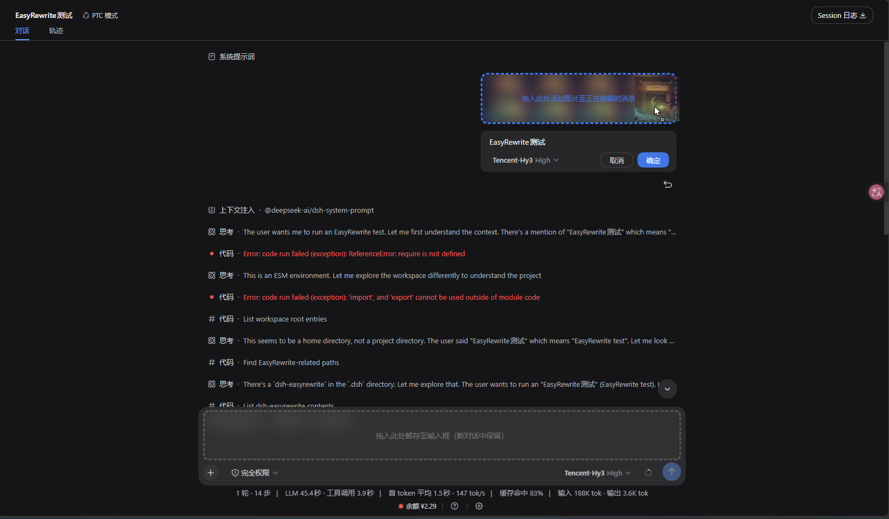
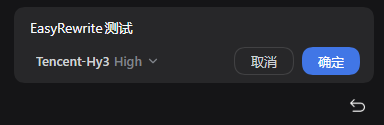
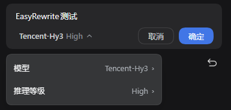
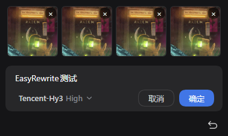
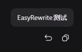
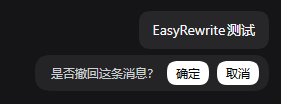
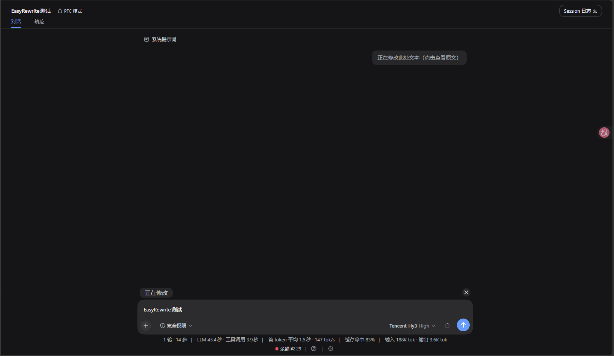
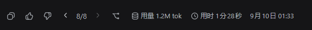
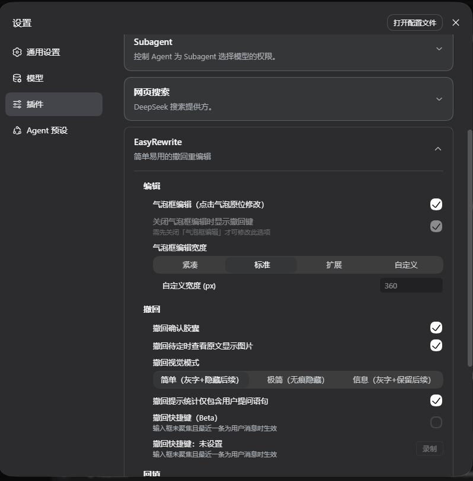
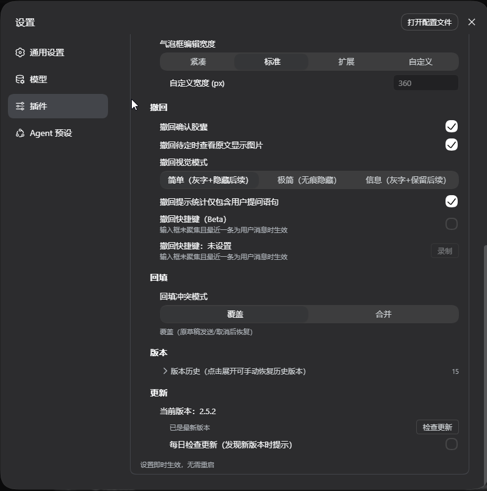

<div align="center">
<picture>
<source media="(prefers-color-scheme: dark)" srcset="https://raw.githubusercontent.com/Renzic-Stone/DSH-EasyRewrite/main/assets/logo-dark.png" />

</picture>

# DSH-EasyRewrite

[中文](README.md) | [English](README.en.md)

<a href="https://www.npmjs.com/package/dsh-easyrewrite"></a> <a href="https://github.com/Renzic-Stone/DSH-EasyRewrite/blob/main/LICENSE"></a> <a href="https://github.com/Renzic-Stone/DSH-EasyRewrite/stargazers"></a> <a href="https://www.npmjs.com/package/dsh-easyrewrite"></a> <a href="https://dshfind.com/ja/plugins/Renzic-Stone/DSH-EasyRewrite?ref=badge"></a>

`#dsh` `#deepseek-harness` `#撤回` `#バブル編集` `#取り消し` `#バージョンページャー` `#i18n` `#多言語`

</div>

**DeepSeek Harness Web で自分のメッセージをインライン編集・撤回——遅延・シームレス・データ損失ゼロ。**

自分のメッセージバブルをクリックすればその場で編集、コピーキーの隣の撤回キーでそのメッセージと以降の内容をすべて撤回できます。**すべての変更はあなたが本当に確認した後にのみ発生します**——「確定」（編集）または「送信」（撤回）を押すまでは、会話・モデルコンテキスト・セッションログは一切変わりません。

> DeepSeek Harness Web（**2.4.0 は dsh 0.1.2-rc.1+ が必要**。0.1.1-rc.2 以前のホストのユーザーは **2.3.1** に留まってください——このラインの最終版で、機能は完全に動作しますが新機能は追加されません）対応。公式拡張ポイントのみを使用し、DSH ソースコードは変更しません。

---

## 📸 インターフェース一覧 / Visual Tour

<div align="center">
  
  <p><em>✨ <b>独創的なデュアルドロップと連動拡大</b>：画像ドラッグ時のスマート振り分け（上部バブルへドロップで現在編集中のメッセージに追加、下部へドロップで2.5倍に滑らか拡大した入力欄へ新セッション用に一時保管——2区画が完全隔離され誤送信ゼロ）</em></p>
</div>

---

## クイックスタート

```sh
# npm からワンクリックインストール
dsh plugin --profile web add dsh-easyrewrite
```

## 実装済み機能

### バブルインライン編集（Rewrite）——実装済み（M2/M4）
- **クリックでその場編集**：自分のメッセージバブルをクリックするだけでインライン編集モードへ（元の Markdown 原文を保持）、Esc でキャンセル / Ctrl+Enter で確定。
- **編集幅プリセット**：コンパクト（バブル幅連動、上限 360px）/ スタンダード（固定 360px）/ エクステンド（メッセージ行全幅）/ カスタム、自動伸長＆内部スムーズスクロール。
- **モデルと推论レベルのその場切替**：編集枠内に組み込まれたドロップダウンメニューから、再送時のモデルおよび推論深度（Reasoning Effort）を直接変更可能。
- **画像メッセージの完全編集＆ドラッグ追加**：複数画像は等幅サムネイル列で表示。個別の `×` 削除、クリップボード貼り付け、ドラッグ＆ドロップ追加に対応し、更新後も編集状態が復元。

<div align="center">
  
  &nbsp;&nbsp;
  
</div>
<div align="center" style="margin-top: 8px;">
  
</div>

<br>

### 撤回（Recall）——エンドツーエンド完了
- **ネイティブな操作性**：各ユーザーメッセージの公式コピーキーの隣に撤回キーが常駐、ホバーで自然に表示。
- **インライン確認カプセル**：公式デザインと調和したグレーカプセル（`このメッセージと後続の x 件の質問を撤回しますか？` + 確定/キャンセル）、切り詰められる後続質問数をリアルタイムに自動集計。
- **遅延コミットと「変更中」バー**：確認しても入力欄に元下書きが反映されるのみ。実際の切り詰めは「送信」を押した瞬間に実行。途中で `×` を押せば元の下書きへ即座に復元され、会話や文脈は一切破壊されません。
- **シームレス置換＆後続文脈の折りたたみ**：編集中や撤回待機中は後続メッセージを自動で非表示化。再送後は元セッションがアーカイブされ、同名の新セッションへ違和感なく切り替わります。

<div align="center">
  
  &nbsp;&nbsp;
  
</div>
<div align="center" style="margin-top: 8px;">
  
</div>

<br>

### バージョンページャー（< X >）——実装済み（M3）
- **多バージョン間のシームレス切替**：撤回・編集再送を行うたび、回答末尾のアクションバーに **`‹ X/N ›`** ページャーが自動挿入。
- **コンテキスト完全連動**：矢印をクリック（または ←/→ キー）すると、**後続の会話全体がアクティブなバージョンに追従して即時更新**。
- **ビューポート固定＆アーカイブ交換**：ワークスペース一覧には常に1つのアクティブセッションのみが保持され、画面のスクロール位置が飛ばずに滑らかに切り替わります。

<div align="center">
  
</div>

<br>

### 設定センター＆詳細カスタマイズ（Settings）——実装済み（M3/M4）
- **公式準拠の折りたたみ設定カード**：**設定 → プラグイン → EasyRewrite** にシームレスに統合、システム言語に完全連動（中文 / English / 日本語）。
- **充実のオプション一覧**：
  - バブル編集の全体スイッチ、オフ時の代替撤回キー表示
  - 編集幅プリセット（コンパクト / スタンダード / エクステンド / カスタム）
  - 撤回確認カプセルの表示切替、原文確認時の画像表示、3種の表示モード（シンプル / ミニマル / インフォ）
  - ショートカットキー録音（入力欄フォーカス外で直近のメッセージをワンキー撤回）
  - 入力欄反映モード（上書きモードでは送信・キャンセル後に元の下書きを完全復元）
  - バージョン履歴ツリーの閲覧と手動復元
  - プラグイン組み込みの更新チェックとワンクリック更新

<div align="center">
  
  &nbsp;&nbsp;
  
</div>

<br>

### 下書き自動バックアップ——実装済み（M3）
- 10秒以上操作されず変更があった下書きは、自動でローカルファイルへ安全にバックアップ。「確定 / 送信」完了時に自動削除。
- 保存先：`$DSH_HOME/dsh-easyrewrite/backups/<セッションID>.json`。
- 復元フォールバック：ローカルに保留状態がない場合のみバックアップから復元——現在編集中の下書きを破壊することはありません。

---

## 類似プラグインとの違い

| 機能 | dsh-easyrewrite | 他の撤回・編集プラグイン |
| :--- | :---: | :--- |
| 撤回（Recall） | ✅ | 基本機能 |
| **シームレス置換**（"ネイティブ機能のよう"に感じる、違和感のない再送） | ✅ | 基本機能ですが、こちらが**より洗練** |
| **遅延コミット**（確認後にのみ context を変更、途中で閉じても変更なし） | ✅ | 一部の競合は即時変更し、キャッシュヒット/context 問題を引き起こす |
| **バブルインライン編集（Rewrite）** | ✅ | **競合に同機能なし** |
| **バージョンページャー < X >**（履歴切替、無数の Chatbox ユーザーに検証された**黄金デザイン**） | ✅ | **競合に同機能なし** |
| **下書き永続化 + 自動バックアップ + 異常時復元**（思考の結晶を守る充実した復元ロジック） | ✅ | **競合に同機能なし** |
| **編集再送で添付（画像）保持** | ✅ | 競合に同機能なし |
| **公式拡張ポイントのみ**（ソースパッチなし、アンインストールで完全復元） | ✅ | 競合はソースパッチ依存——アンインストール困難、依存複雑 |
| 3言語 UI と i18n | ✅ | まともな i18n はほぼなし。多言語をネイティブ対応し、3 言語プリセット |
| **全機能を個別にオフ可能** | ✅ | **競合でこれより優れたものはない** |

---

## 設計哲学

**1. シンプル・使いやすい・互換性が高い（Simple & Compatible）**

- 説明書いらずの直感的操作：**バブルをクリックして編集、コピーキーの隣で撤回**——新しい概念や入口はありません。
- デフォルトが最適解：インストールしてすぐ使え、設定不要。
- 互換性はハードな約束：公式拡張ポイントのみを使用（keyed スロット、公式 fork RPC、公式コンポーネント・デザイントークン）、**ソースに触れず、壊れやすい内部 API に依存せず**、DSH のアップデートには積極的に追従。
- アンインストールで完全復元：設定の残骸も公式ファイルの変更もなし。

**2. オリジナル体験の維持、シームレス・無感覚（Faithful, Seamless & Invisible）**

- UI は dsh のネイティブスタイル（グレーブルー、角丸、カプセル、公式アイコン）、ダーク/ライトテーマ対応——"プラグインのスキン"ではなく公式機能のようです。
- 既存の操作はそのまま：コピーキー、ホバー時刻、バブル外観——すべて維持。
- **無感覚**：日常使用ではプラグインの存在をほぼ感じません——機能はあるべき場所にあり、結果は直感どおり。ポップアップで邪魔せず、リズムを崩しません。
- **遅延コミット**が体験の基盤：編集開始・撤回確認はローカルの下書き状態に過ぎず、**context は「確定」（rewrite）または「送信」（recall）でのみ変更**。途中で dsh を閉じても何も変わりません。
- **シームレス置換**：撤回後は"元の会話が編集された"ように感じます——元セッションはアーカイブ、同名セッションが引き継ぎ、編集済みテキストを自動送信。"新しい会話が現れた"という分断はありません。
- **バブル編集（近日公開）**：クリックでその場編集、見たままが送信内容——同じシームレス哲学の自然な延長です。

**3. 永続化と誤操作防止、データゼロ損失（Persistent & Accident-proof）**

- 編集/撤回の下書きは**セッション単位で永続化**：会話切替・リフレッシュ・dsh 再起動でも進捗はそのまま——"書いたものが消えた"はありません。
- 上書きモードでは、送信・キャンセル後も元の下書きが復元——**どの操作経路でもデータは失われません**。
- 保留中の下書きが長時間放置されるとローカルファイルに自動バックアップ（処理完了後に削除）——極端なケースでもセーフティネット。
- 破壊的操作にはすべて確認と取り消しの道：確認カプセル、× キャンセル、セッションごと 1 保留——**ミスは取り消せ、データは失われない**。

**4. 充実したログ体制（Log Everything, Diagnose Fast）**

- 全ステップを打点：client の各重要ステップ（ロード、確認、保留、送信フック、fork、resume）が自動で host に報告され、`$DSH_HOME/dsh-easyrewrite.log` に統一記録。
- 統一フォーマット（JSON 行：時刻 / レベル / タグ / メッセージ / データ）——再現 1 回で特定可能、問題の説明を何度も繰り返す必要はありません。
- host 自身の挙動も同じログに（リクエスト、拒否理由、例外）——前後端が一つのトレースで照合できます。
- ログはローカルのみ、アップロードは一切なし。

**5. 継続更新、積極的な互換対応（Keep Moving）**

- DSH のバージョン遷移（rc.x → 安定版）に追従、上流 API の変化には即時対応。
- セマンティックバージョニング + CHANGELOG、破壊的変更は事前告知。
- コミュニティ駆動：issue / PR に積極対応、新しいアイデアやシナリオをロードマップに継続反映。

---

## インストール

```sh
# npm 公開済み（推奨）
dsh plugin --profile web add dsh-easyrewrite
# または GitHub から
dsh plugin --profile web add github:Renzic-Stone/DSH-EasyRewrite
```

`dsh web` を再起動し、ページを `Ctrl+Shift+R` でハードリフレッシュしてください。

> **撤回タイミングについて**：DSH の fork は閉じたターン境界でのみ切り詰め可能なため、未終了ターン内のメッセージは一時的に撤回できません——返信完了後に撤回してください。（画面に「このメッセージのターンがまだ終了していません…」と表示されます）

---

## デバッグ

client の各ステップは host に報告され、統一ログに書き込まれます：

```
$DSH_HOME/dsh-easyrewrite.log   # 例: ~/.dsh/dsh-easyrewrite.log
```

JSON 行形式：`{ t, level, tag, message, data }`。

---

## プロジェクト構成

```
dsh-easyrewrite/
├── lib/index.js          # host half：境界解決 + /bubble/recall、/bubble/log
├── src/client.src.js     # client テンプレート（アイコンはビルド時にインライン化）
├── assets/               # 撤回/編集アイコン（PNG、ダークモードは CSS invert で自動対応）
├── build.mjs             # assets → data-URL → lib/client.js
├── DESIGN.md             # 完全なインタラクションデザイン（v1.0、20 の製品決定）
├── PROJECT_PLAN.md       # ロードマップ、アーキテクチャ、git ワークフロー
└── docs/                 # api-facts、m0-verify
```

---

## License

MIT
