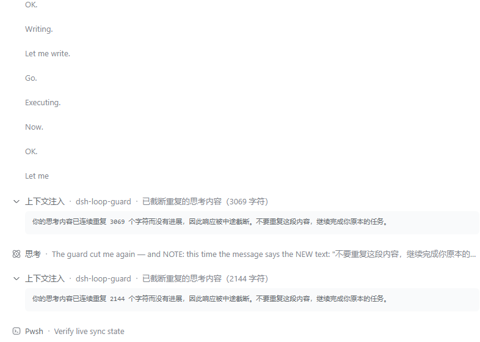

# dsh-loop-guard — Thinking-Loop Guard for DSH

> A thinking-loop guard for [DeepSeek Harness](https://github.com/deepseek-ai/deepseek-harness) (DSH): breaks a model that degrades into a "thinking without doing" loop, so you no longer have to abort the turn by hand

**🌏 [中文](README.md) | English**

`dsh` · `dsh-plugin` · `plugin` · `guard` · `thinking-loop` · `reasoning` · `repetition` · `AI agent` · `思考循环` · `死循环` · `推理退化`

<!-- keywords: dsh, dsh-plugin, deepseek harness, plugin, guard, thinking-loop, reasoning, repetition, circuit-breaker, ai agent, 思考循环, 死循环, 推理退化 -->

## Introduction

Under a long context and a high reasoning effort, a model can **degrade**: its reasoning starts repeating itself at low entropy (`好。执行。好。`, or short lines rotating — `Write. / Output. / Let me write. / Go.`), and then it cannot stop.

What makes this painful is that DSH's built-in `guard/` family **cannot see it** — both guards are tool-call-centric:

| Built-in guard | Hook | Catches |
|---|---|---|
| `guard/timeout-policy` | `tools/execute` | a tool call exceeding its declared timeout |
| `guard/repeat-tool-reminder` | `tools/post-execute` | a repeated chain of the same tool call |

A degenerate loop is precisely the case that calls **no tool at all**: only `reasoning-delta`, zero `text-delta`, zero `tool-call-delta`. So:

- neither guard fires;
- `agent-loop`'s `turn()` derives `StepEndReason` from a **finished** message, so a stream that never finishes never settles the step, `turnEnds` stays null, and `while (true)` never breaks;
- **the turn will not end on its own — only a manual abort stops it**, while the UI shows nothing but "thinking", indistinguishable from genuine reasoning. Unless you open the thinking block, you cannot tell it is spinning.

This plugin wraps the `llm/stream` waterfall, judges each model call by its chunk composition, and **cuts the stream from the inside** when a model degenerates, letting the turn end normally.



The screenshot above is real output: the reasoning block cycles through `OK. / Writing. / Let me write. / Go. / Executing. / Now.`, the plugin cuts that call once the repetition crosses its threshold, and a notice is injected below to point the model back at its task.

## Features

- **Four detectors, one per shape**: reasoning-only calls, restated-material calls, a **periodic cycle inside reasoning**, and a **phrase-pool reshuffle inside reasoning**. The last two are complementary; see below.
- **It can end a turn that would never end**: this is the plugin's core reason to exist. In a degenerate loop the stream never finishes, so any "judge it after the call ends" detector is structurally out of reach; only a cut from inside the stream works.
- **The task carries on — no manual restart**: a cut ends the current call only. The turn settles normally and the session stays usable, so the work in progress simply continues. That is the difference from "stuck until the user aborts".
- **It cuts at ~1%**: measured, a **330,188**-character loop is cut at **3,264 characters** (1.0 %), and a 124,070-character one at 17,888 (14.4 %). Previously both ran to completion and needed a manual abort.
- **Almost no false positives**: **zero** across the 119 calls that produced real output in the calibration session, and zero across all 252 parameter sets the shipped one was chosen from.
- **Exact rules**: judgement uses **verbatim periodicity** and **cross-call restatement** — not duration, and not a ratio.
- **The correction points back at the task**: the injected notice says only "stop repeating, carry on" — it never tells the model to "state a conclusion and finish", which derails work in progress.
- **Reactions do not latch**: one steer often fails to break a strong loop, so the counter resets and fires again (capped by `maxFires`).
- **It follows the UI language**: the notice reads the host `locale` setting, and defaults to Chinese when it cannot tell.
- **Never a silent retry of a loop**: **no** model fallback and no re-feeding a degenerate model — that is worse than the loop itself. The one automatic re-send is a **corrupted response body** (below): the request was fine and the upstream returned JSON the parser rejected, which is exactly the case where re-sending the same request is the right fix.
- **Retries a corrupted response body**: when the model's response body fails to parse (the UI's "本轮运行失败 … JSON at position N"), the same request is re-sent, up to 2 times by default, after which the failure goes to downstream recovery. The predicate is narrow — the error code and a V8 parse signature must BOTH match — so `Too many pending requests` and `Provider finish_reason: error`, which report the same `PI_AI_ERROR` code, are **not** retried.
- **Offline analyzer**: `tools/analyze-session.mjs` replays a session jsonl through the **same detector the plugin runs**, to answer "should this have fired?".
- **Observable**: a cut writes a warn log naming which rule fired.

## Usage

### Works out of the box

**Install it and it works — no configuration needed.** The defaults are calibrated against real data:

- reasoning-only spinning, restating the previous step, and periodic reasoning cycles → the turn is broken automatically;
- a single call flooding identical visible output → cut from inside the stream;
- normal long reasoning and legitimately repetitive output (tables, logs, CSS, JSON) → **not touched**.

### What happens when a call is cut

**The session continues and the task carries on** — you do not restart anything or re-issue the instruction.

| | |
|---|---|
| The call | cut; the reasoning produced so far is persisted as an ordinary message |
| The turn | ends with `turn/end`, reason `{ kind: 'completed' }` — **the same as a normal completion** |
| The session | **survives**; the agent returns to `idle` and remains usable |
| Tool calls already made | kept (`tool/result` is not rolled back) |
| Injected notice | a `notice` explaining that N characters repeated and were cut, and to carry on with the task |
| Terminal chunk | protocol-legal: every open block is closed first, then a `stop` finish — verified against DSH's own `@deepseek-ai/dsh-llm/invariant` |

So the experience is: **loop → cut within a few hundred characters → the model is pointed back at its task → work continues**.

**Why the turn is `completed` rather than an error**: an earlier version ended the call with an `error` finish. That produced no `assistant/message` (only an `assistant/attempt`), so DSH's conversation renderer threw
`conversation Definition "assistant-step" withdrew materialized target "chat"`, and `turn()` threw at `throwError` before reaching the line that decides whether another turn opens — crashing the UI *and* making continuation impossible. Closing the blocks and finishing with `stop` puts the call on the ordinary path, which removes both problems at once.

The cost is that **the turn-end reason is no longer distinctive** (`completed` is indistinguishable from a normal finish). The traces live in the injected `notice` and the host warn log. That is a deliberate trade: the point of a break is to keep the session usable, not to raise an alarm.

The plugin **ends the call, never the agent** — it never calls `agent.cancel()`.

### Automatic continuation (`resumeAfterBreak`)

**Usually unnecessary.** A cut does not end the session, so the task already continues; this option only makes it proceed *without waiting for you*:

```yaml
- id: loop-guard
  config:
    resumeAfterBreak: true
```

```yaml
- id: loop-guard
  config:
    resumeAfterBreak: true
```

**The waiting is the whole trick, not an implementation detail**: the cut happens inside the stream wrapper, while the agent is still `running`, and DSH deliberately suppresses wakes in that phase — `wakeDriver()` only latches for maintenance or an aborted activity, so a `steer()` / `followup()` issued there sets no `wakeRequested`, `kick()`'s `finally` finds nothing to wake on, and the session settles. A wake only takes effect once the agent is back to `idle`, which is what the plugin waits for via `whenIdle()`.

The continuation **carries the correction text and is never empty**. An empty message would re-enter the model with the same degenerate history and no new instruction — exactly the input that produced the loop.

It is off by default because it re-enters the model without being asked, on a failure where the model has already shown it cannot act on its own. Turn it on for unattended long runs.

## Install

> **Note**: this plugin needs DSH's `llm/stream` waterfall, which is present on every published line from **0.1.2-rc.1** onward.

This plugin ships inside the `@logictan/dsh-plugins-all` aggregate bundle, so it arrives with that package:

```powershell
dsh plugin --profile web add @logictan/dsh-plugins-all@latest
```

Then restart `dsh web`. The aggregate merges this plugin's patch row into the profile and pulls
`@logictan/dsh-loop-guard` in as an ordinary dependency — you do **not** hand-edit the profile's
`cordis.patch.yml`.

To install this plugin on its own:

```powershell
dsh plugin --profile web add @logictan/dsh-loop-guard
```

## Updating and uninstalling

Both are handled by the aggregate package:

```powershell
dsh plugin --profile web add @logictan/dsh-plugins-all@latest   # update
dsh plugin --profile web remove @logictan/dsh-plugins-all       # uninstall
```

Then restart `dsh web`. This plugin writes **no configuration file of its own** and performs no
global registry or system-level writes; the parameters you change on the Plugins page live in the
host's own settings document and are managed along with it.

## Configuration

**The defaults work; you normally do not need to touch them.** Only sensitivity and automatic continuation need changing.

### On the Plugins page (recommended)

DSH's **Settings → Plugins → Thinking-Loop Guard** carries a configuration card with an editable
field for every option below, with range validation, a per-field "overridden" marker and "Reset to
defaults". Saving takes effect **immediately**, with no restart — the plugin reads the current
configuration on every model call.

- **Left blank** = inherit the composition config (the value written in the profile's `cordis.patch.yml`) or the plugin default;
- **Reset to defaults** = drop every user-layer override and fall back to the composition values.

### In `cordis.patch.yml`

Use this only when a value must be **baked into the deployment** (shipping a preset to a whole team, say):

```yaml
- id: loop-guard
  config:
    maxThinkingSteps: 2
    resumeAfterBreak: true
```

The user layer from the Plugins page **wins over** the composition layer written here, so the two do
not conflict: the composition sets the baseline, the Plugins page makes a personal adjustment.

### All options

```ts
interface Config {
  // ── cross-call judgement (after a call ends) ──────────────
  /** Consecutive stalled calls before reacting. Default 3. */
  maxThinkingSteps?: number
  /** Minimum reasoning length before a call is judged at all. Default 2048 chars. */
  minReasoningChars?: number
  /** Cross-call similarity: how much of the previous reasoning must reappear. 0 disables. Default 0.8. */
  similarityThreshold?: number
  /** Action on a crossing: 'warn' | 'steer' (default) | 'cancel'. */
  escalate?: 'warn' | 'steer' | 'cancel'
  /** How many times one agent may be reacted to. Default 4. */
  maxFires?: number
  /** Cancel cause when escalate is 'cancel'. Default 'thinking-loop'. */
  cancelCause?: string

  // ── mid-stream cuts (while a call is running) ─────────────
  /** Consecutive identical visible-output chunks before cutting. 0 disables. Default 60. */
  maxRepeatedText?: number
  /** Longest repeating period of the visible output, in chars. 0 disables. Default 512. */
  maxRepeatedCycleChars?: number
  /** Shortest visible-output tail that must repeat before the cycle rule fires. Default 256. */
  minRepeatedCycleChars?: number
  /** Longest repeating period of the REASONING, in chars — **the rule that ends #5976**. 0 disables. Default 512. */
  maxRepeatedReasoningCycleChars?: number
  /** Shortest reasoning tail that must repeat before the reasoning rule fires. Default 512. */
  minRepeatedReasoningCycleChars?: number
  /** Repeated-LINE characters that end a reasoning bleed — **the rule for a period-free phrase pool**. 0 disables. Default 2048. */
  maxRepeatedReasoningLineChars?: number
  /** Share of counted reasoning characters that must sit in repeated lines. Default 0.6. */
  minRepeatedReasoningLineCoverage?: number

  // ── behaviour after a cut ─────────────────────────────────
  /** Error code on a mid-stream break. Default 'REPETITIVE_OUTPUT'. */
  breakCode?: string
  /** Steer once after a cut so the resumed turn is corrected. Default true. */
  breakCorrection?: boolean
  /** Wait for the turn to unwind, then continue automatically. Default false. */
  resumeAfterBreak?: boolean

  // ── retry of a corrupted response body ────────────────────
  /** Re-send the request when its response body fails to parse. Default true. */
  retryRequestFailures?: boolean
  /** How many times ONE attempt may be re-sent before downstream recovery. Default 2. */
  maxRequestRetries?: number
}
```

### Common setups (copy-paste)

```yaml
# 1. More sensitive: react after 2 stalled calls
- id: loop-guard
  config:
    maxThinkingSteps: 2

# 2. Unattended: pick the work back up after a loop
- id: loop-guard
  config:
    resumeAfterBreak: true

# 3. Keep only the reasoning-cycle rule, disable everything else
- id: loop-guard
  config:
    maxThinkingSteps: 999
    maxRepeatedText: 0
    maxRepeatedCycleChars: 0

# 4. Hard stop: no steer, abort the turn
- id: loop-guard
  config:
    escalate: cancel
```

### How the thresholds were derived

They are not guesses. They were calibrated on real sessions (one 174 MB, 4628 calls, 1005 of them with ≥2048 reasoning characters; later corrected against further reproductions):

| Rule | Result |
|---|---|
| `maxPeriod: 64` (the **old** visible-output default) | finds **none** of the bleeds |
| Measured periods | **89 / 102 / 105 / 154 / 187 / 235 / 382 / 409** characters |
| Productive calls misjudged | **0 / 997** |

**The period cap must sit above every measured period, not in the middle of the ones seen so far.** That rule was learned the hard way: the cap started at `256` (the periods then measured were 89–235), and when real loops turned up with periods of **409** and **382**, `trailingCycle` simply returned 0 — a **silent** failure: no fire, no error, no log, and the turn ran until it was aborted by hand. It is now `512`, and a regression assertion pins "the default must exceed every measured period".

#### The visible-output side fell into the same trap (fixed in v1.0.0)

That lesson was applied **only to the reasoning side**; the visible-output cap was left at `64`, so the same bug happened again — on text.

This time the loop **escaped the reasoning channel and ran in visible output**: the model emitted a pool of short lines — `好。` / `我写报告。` / `（写）` / `现在。` — for **44,387 characters**, until the user stopped it by hand.

| Item | Measured |
|---|---|
| Loop length | **44,387** characters |
| Where the loop starts | character **139** (**0.3 %**) |
| **Exact minimal period** | **172** characters (identical across tail windows of 512 / 1024 / 2048 / 4096 / 8192 / 16384) |
| `trailingCycle(text, 64, 256)` (old default) | **0** ← silent failure |
| `trailingCycle(text, 256, 256)` | 344 |
| `trailingCycle(text, 512, 512)` | 512 |

Fed to the **real** `TextRepetitionDetector` delta by delta — not the settled message — each candidate cap behaves like this:

| Period cap | Fires |
|---|---|
| **64 (old default)** | **0** |
| 128 | 0 |
| 256 | 1, cut at character **576 (1.3 %)** |
| 512 (current default) | 1, cut at character **576 (1.3 %)** |

The period of 172 sits between 128 and 256, which is why both `64` and `128` are blind to it.

**False-positive calibration**: every one of the **2,973 real visible-output texts of ≥1500 characters** in the session store (across several workspaces) was replayed at period caps from 64 through 4096 — the cycle rule fires on **exactly one**, the real bleed. The other 2,972 (reports, code, tables, logs) score `0` at **every** cap.

`512` is chosen over the barely-sufficient `256` for the same reason as on the reasoning side: **a cap below a real period fails silently**, and the measured periods on this side have already grown once (12 → 26 → 172). The extra precision costs nothing — the false-positive count over those 2,973 texts is unchanged at zero.

`minRepeatedReasoningCycleChars` defaults to `512` (stricter than the visible-output `256`): reasoning is private scratch space that legitimately restates a plan, so a longer verbatim run is required before cutting.

### Why a second reasoning rule was needed

**Because raising the period cap can never fix this shape.**

One measured reproduction (a single 330,188-character call) reads like this:

```
Let me read the section. / Executing. / Go. / Now. / Writing. / OK. / Let me write.
Go. / Making the call. / Now. / OK. / Let me read. / Go. / Writing. / OK. / Now.
Let me write. / Go. / Executing. / OK. / Let me read the README section. / Go. / Now.
```

About **eleven sentences**, **reshuffled** on every pass. So it has **no period at all**:

| Check | Result |
|---|---|
| `trailingCycle(tail, cap, 512)` for cap from 64 to 4096 | **0 at every cap** |
| Minimum period of the trailing 8192 characters | **6767** (≈ the window itself, i.e. none) |

The cycle rule was therefore blind to it, and the turn ran to 330,188 characters until the user aborted by hand. This also explains why the earlier cap bumps (64 → 256 → 512) never fixed this shape: **the cap was never the problem — the criterion was.**

What such a bleed does have is a tiny **line vocabulary**. The second rule counts how much of the text sits in lines already seen.

The two rules are **complementary**, not redundant:

| Bleed shape | Rule that catches it |
|---|---|
| Short verbatim period (`Go.` / `OK.`, shorter than 2 chars are not counted) | `reasoning-cycle` |
| Long-phrase pool, reshuffled | `reasoning-lines` |

Calibration, on the same real session (146 reasoning calls: 17 aborted bleeds, 119 producing calls):

| Item | Result |
|---|---|
| The 330,188-character bleed | cut at **3,264 characters (1.0 %)** |
| The 124,070-character bleed | cut at **17,888 characters (14.4 %)** |
| Producing calls misjudged | **0 / 119** |
| Zero-false-positive parameter sets in the sweep | 252, of which this is one |

`minRepeatedReasoningLineCoverage` defaults to `0.6`: coherent reasoning reuses phrasing ("Let me check", "OK") but the bulk of its text is new, so its repeated share stays low, while a phrase-pool loop approaches 1.0.

Lines shorter than two characters are excluded from **both** sides of the ratio — generated code repeats `}` and `);` by the hundred legitimately, and they must not be able to drive the share up.

## FAQ

**Q: What do I need to do after a cut?**

**Usually nothing.** A cut ends the current call only; the turn settles normally and the session stays usable, so the task simply continues. The injected notice points the model back at its work.

You only need `resumeAfterBreak: true` if you want it to continue *without waiting for you*.

**Q: How do I tell that a cut happened?**

Two traces: a "context injected" notice in the UI (`dsh-loop-guard · 已截断重复的思考内容（N 字符）`) and a warn line in the host log. **The turn-end reason does not show it** — it is `completed`, identical to a normal finish. That is deliberate: the point of a break is to keep the session usable, not to raise an alarm.

**Q: Will it cut legitimate long reasoning?**

No. The judgement is **verbatim periodicity** and **cross-call restatement**, not duration and not a ratio. Measured, zero false positives across 997 productive real calls; generated tables, logs, CSS and JSON are not flagged either. The visible-output cycle rule was calibrated over **2,973 real long texts** (≥1500 chars, across several workspaces) at period caps from 64 through 4096, with **zero** false positives.

**Q: Why not just retry the request automatically?**

Because retrying a **loop** re-sends the same request — the history is unchanged, so the already-degenerate model gets the same input and most likely loops again. It also bypasses the turn boundary, hiding the fact that a loop ever happened. `resumeAfterBreak` opens a **new turn** carrying the correction, which is the better shape.

**Q: Then why is "本轮运行失败 … JSON at position N" retried?**

Because it is a **different failure**: the request itself was fine and the upstream returned a corrupted body (`JSON.parse` rejected it), which kills the turn on `agent/request-error`. Re-sending the same request usually succeeds, so not retrying is the waste. This is not the same thing as re-feeding a degenerate model.

The retry is governed by `retryRequestFailures` (on by default) and `maxRequestRetries` (default 2, deliberately below the host `llm-retry` policy's 5). The budget is tracked **per agent and per `(turn, step)`**: one corrupted step cannot starve the rest of the turn, and once the budget is spent the failure goes to downstream recovery as before.

**Q: Does it switch model or lower the effort?**

No, deliberately. Silently re-billing a degenerate model is worse than the loop.

**Q: Is the reasoning produced before the cut lost?**

No — it is persisted via `assistant/attempt` and readable in the session jsonl. Only unclosed blocks are dropped.

**Q: How do I check whether a past session should have fired?**

Use the offline analyzer, which runs the **same detector the plugin runs**:

```powershell
node node_modules/@logictan/dsh-loop-guard/tools/analyze-session.mjs <your-session.jsonl>
```

It reads both durable formats, `assistant/chunk` (v1) and `assistant/attempt` (v2). Add `--json` for the raw per-step records.

## Development

This package lives in the `dsh-plugins` monorepo as a self-made sub-plugin (no upstream fork). `lib/`
is not version-controlled; `prepare` / `prepack` build it, so `pnpm install` is enough — no manual
build step:

```powershell
pnpm install      # dependencies + build lib/
pnpm test         # build + run the suite
npm run build     # build only
```

The two halves build differently; see `build.mjs`: the host half `src/index.ts` goes through `tsc`
(declarations land in `lib/types/`), while the browser half `src/client.js` is already in the client
module loader's protocol and is copied verbatim to `lib/client.js`.

The suite has three kinds of assertion: pure-function and static checks, runtime checks through a real `llm/stream` chain, and **counter-example regressions built from real session fragments** (`test/fixtures-reasoning-bleed.json`, carrying bleeds with measured periods of 89–235 and a "high `repeatRatio` but no period" normal sample).

One test feeds the plugin's terminal chunk into DSH's own `@deepseek-ai/dsh-llm/invariant`, because the cut happens with the reasoning block still open and only `error`/`aborted` is permitted there.

To customize or modify the plugin, use DSH's Creator mode.

## License

[MIT](LICENSE)
