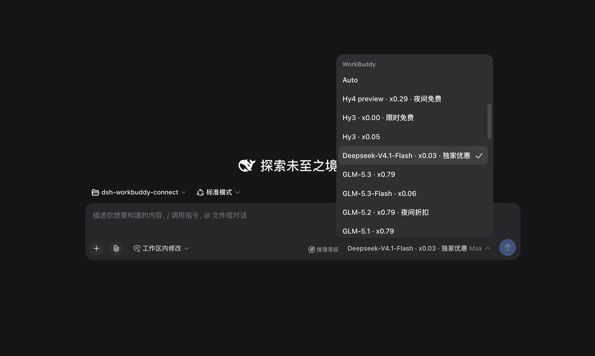
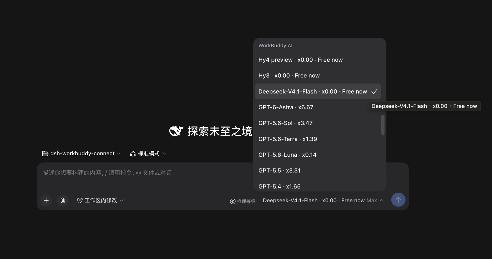
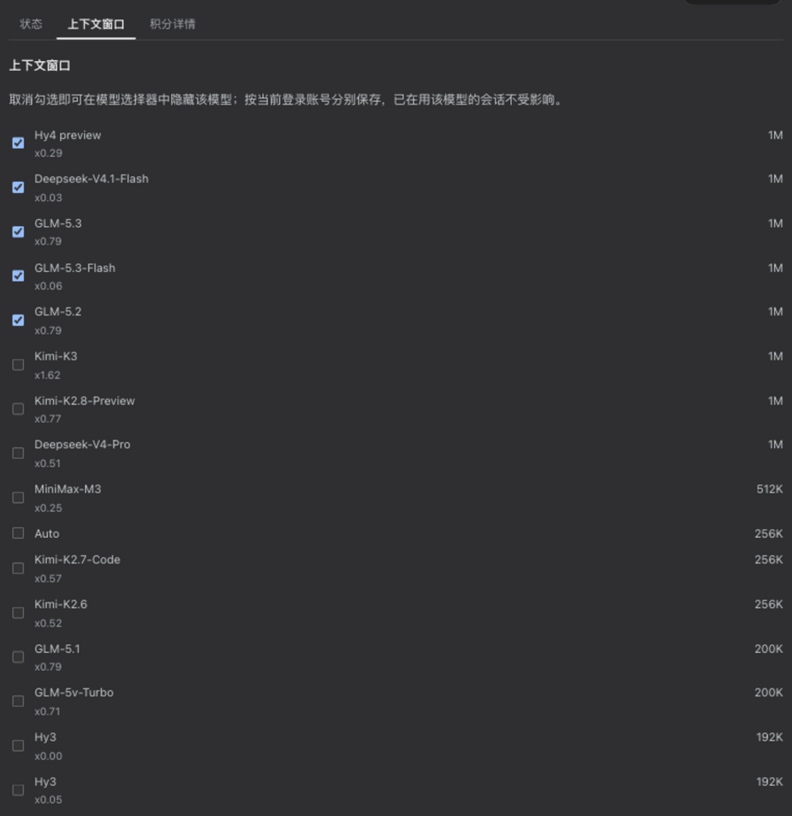
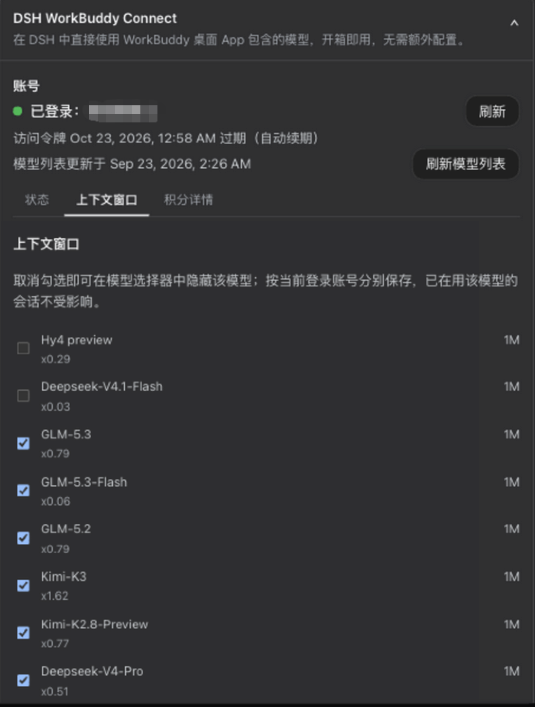
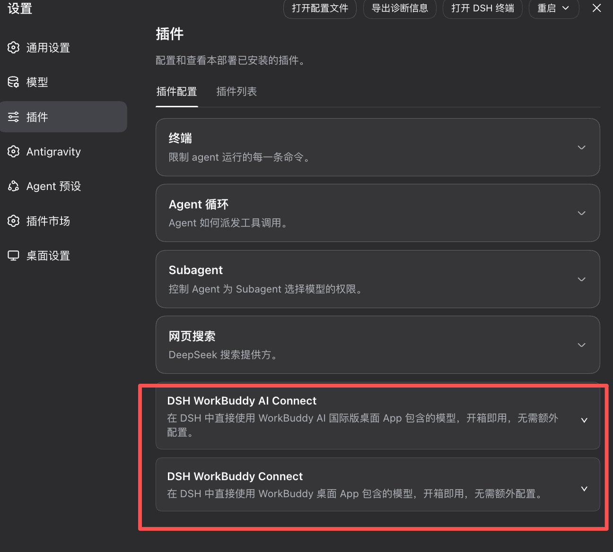
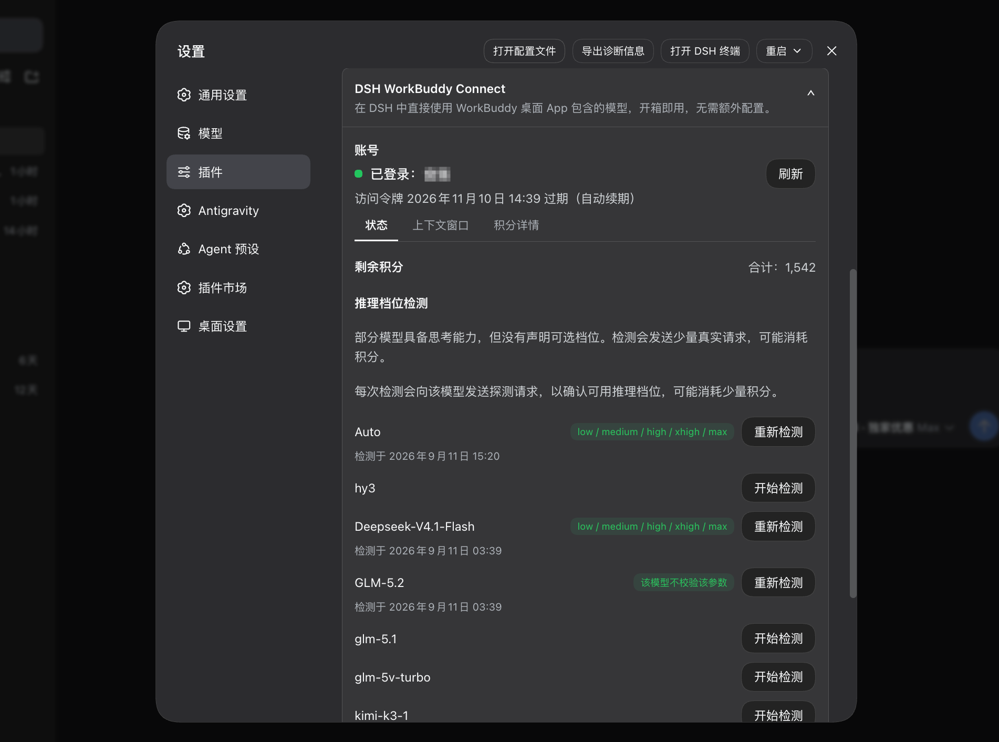
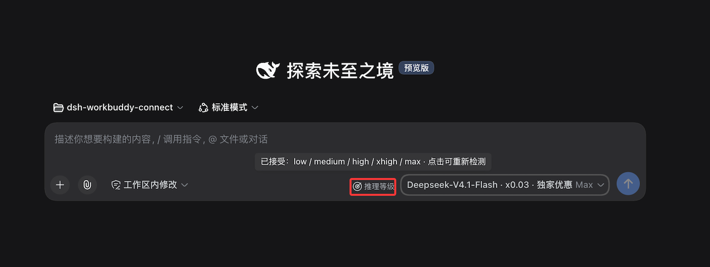

# DSH WorkBuddy Connect


[English](./README.en.md) | 中文


将 WorkBuddy 桌面 App 中包含的各种模型（GLM-5.3、GLM-5.2、DeepSeek-V4-Pro、DeepSeek-V4-Flash、Kimi-K3、MiniMax-M3 、Hy3等）自动接入 DeepSeek Harness，实现在 DSH 对话窗口里零配置使用。

国内版 **WorkBuddy** 与国际版 **WorkBuddy AI** 同时支持（国际版自 **v0.5.0** 起）：装哪个 App 就出现哪个模型分组，两个都装就两组并存，各自用自己的账号与积分。


## 功能

- **开箱即用**：安装和启用插件后，在 DSH 中直接使用，无需额外配置。





- **国内版与国际版并存**：国内版显示为「WorkBuddy」分组，国际版（WorkBuddy AI）显示为「WorkBuddy AI」分组。两版的模型、账号和积分互不混用。**各自只看自己那版 App 的登录状态**：只装国际版就只出现「WorkBuddy AI」，两版都装就两组都在，退出其中一版则对应分组消失。设置里也是**两张卡片**，分别展示各自的账号与余额。




- **图片输入**：大部分模型支持发图，在对话里直接粘贴或拖入图片即可（GLM-5.3-Flash、GLM-5.2、DeepSeek-V4 系列等）；少数只支持文字的模型（如 GLM-5.1）会明确提示不支持。


- **推理档位**：WorkBuddy 明确声明的档位会直接显示，例如 GLM-5.3 和 GLM-5.3-Flash 可选 low / high / max。对于部分没有声明可选档位的模型，Web 和 Desktop 可在模型选择器中点击「推理等级」手动检测；检测会发送少量请求，可能消耗积分。未检测或没有可用档位的模型仍使用 WorkBuddy 的默认档位。


- **信息查看与检测**：设置 → 插件 → 对应卡片可查看账号、令牌有效期、剩余积分和模型优惠（DSH `0.1.6+` 上入口在左侧栏「插件」面板，见下方版本对应一节）；也可以手动刷新模型列表，并在卡片上看到当前列表来自上游还是内置兜底。对于可检测模型，也可以在这里手动检测推理档位。

- **模型显隐**：WorkBuddy 与 WorkBuddy AI 都可以在对应卡片的「上下文窗口」标签里勾选要在模型选择器中显示的模型。隐藏配置**按登录账号分别保存**：切换账号自动切换各自的配置，切回后恢复；新账号和新上架的模型默认显示。隐藏只影响选择器里的可选性，**正在使用该模型的已有会话不受影响**。



同一份界面在 DSH 0.1.5 的设置卡片中原样生效：



- **企业账号积分**：国内版企业账号（`enterpriseId` 非空）走企业专用计费接口读取周期额度，卡片显示「企业额度」与周期重置时间。

- **费率比例**：模型选择列表里每个模型名后直接显示积分倍率（如 `GLM-5.2 · x0.79`、`Hy3 · x0.00`），`/model` 弹窗与输入框的模型下拉都能看到。倍率只是显示，不影响实际请求。


- **徽章展示**：促销徽章（限时免费、夜间折扣）直接跟在模型名后面（如 `Hy4 preview · x0.00 · 限时免费`），选模型时一眼可见；设置卡片里也会汇总当前有优惠的模型。以 WorkBuddy 服务端的数据为准，每次启动 DSH 时同步。国际版的促销来自服务端的 `modelPromotions`（含生效时段）：促销过期后徽章会撤销；由于服务端把折后价直接写在模型的倍率字段里，原价无法还原，此时该模型的倍率会显示为「价格未知 — 刷新后更新」，而不是继续显示折扣价或「免费」。



卡片展开后分为「状态 / 上下文 / 明细」三个标签：状态页展示账号、令牌有效期、合计积分、模型列表来源与推理档位检测；上下文页列出各模型的上下文窗口。国际版在上游声明了更大可选窗口时，可在这里切换「使用上游声明的最大上下文窗口」；该开关**默认开启**，DSH 会按上游声明的最大窗口安排上下文压缩；想改用上游的默认窗口就在这里关掉，偏好会持久化，重启后保持。明细页展示各套餐余量与模型优惠。国内版与国际版各有一张自己的卡片，各显示自己账号的信息。



## 推理档位为什么这样设计

WorkBuddy 中模型的推理档位信息目前分散在上游接口与客户端自身的私有 UI 逻辑中，且模型目录变化很快。若插件根据经验为所有未声明模型补齐统一档位，就需要持续追赶这些未公开、没有稳定契约的产品逻辑。




实测还发现，有些模型虽然接受 `reasoning_effort` 参数，却可能忽略未知值并回退到默认行为；一次请求返回成功，并不能证明某个档位真实可用。

因此，对于没有声明档位的模型，Web 和 Desktop 采用用户主动授权触发、动态获取档位的方式：先确认上游会校验该参数，再逐项确认哪些规范档位被接受。检测会发送少量请求，可能消耗积分；结果只表示当前上游接受该档位，不承诺它一定改变推理效果、速度或积分消耗。

## 安装

前置：已安装并登录 WorkBuddy 桌面 App。插件复用 App 的登录状态，账号切换自动跟随；装了国际版 WorkBuddy AI 的同样适用，两版互不影响。

**版本对应（重要）**：自 **`0.6.0`** 起，同一个插件版本横跨两代 DSH 核心，安装时无需再逐版本对照；更早的已发布版本仍与核心一一对应，不可混用——不匹配的组合会导致 DSH 启动失败：

| 插件版本 | 要求的 DSH 核心 | 桌面 App |
|---|---|---|
| **0.6.0（双界面自适应）** | `0.1.5-rc.1` / `rc.2` / `rc.3`；`0.1.6-alpha` 系列（含 `alpha.1` / `alpha.2`）与 `0.1.6` 正式版；已实测 `0.1.7-alpha.1`（`0.1.7` 正式版同样在范围内）。**更新的 prerelease（如 `0.1.8-alpha.x`）不自动覆盖**，需插件显式跟进 peer range 后才支持 | `2.0.7`+ 可直接使用；搭载 `0.1.6+` 核心的桌面版发布后同样适用 |
| **0.3.2 – 0.5.4**（国际版支持自 `0.5.0`） | `0.1.5-rc.1` 系列（不支持 `0.1.6+`，见 [#41](https://github.com/corrinehu/dsh-workbuddy-connect/issues/41)） | `2.0.7`+（内置核心已跟进 `0.1.5-rc.1`） |
| **0.3.0 – 0.3.1** | `0.1.2-rc.1` | `2.0.5` |
| **0.2.6** | `0.1.1-rc.2`（旧线） | `2.0.3` / `2.0.4` |

- **计划中的 `0.6.0` 不要求为了安装 WorkBuddy Connect 强制升级到 DSH `0.1.6`**：插件在加载时按宿主实际提供的配置入口自适应，`0.1.5` 与 `0.1.6+` 各自走各自的界面，互不干扰。
- **配置入口随 DSH 版本不同**，两代各就各位：

  ```text
  DSH 0.1.5 + 本插件
  ├─ 设置 → 模型
  │   └─ 不显示 WorkBuddy 两行 ← 与 0.1.6+ 统一（≤0.5.4 旧版插件才显示那两行旧 configurable-provider 条目）
  ├─ 设置 → 插件
  │   ├─ DSH WorkBuddy Connect      ✅ 配置卡片（国内版）
  │   └─ DSH WorkBuddy AI Connect   ✅ 配置卡片（国际版）
  └─ 聊天模型选择器
      └─ WorkBuddy / WorkBuddy AI 分组 ✅

  DSH 0.1.6+ + 本插件
  ├─ 设置 → 模型
  │   └─ 不显示 WorkBuddy 两行      ← 有意如此，两代行为统一
  ├─ 设置 → 内置插件
  │   └─ workbuddy-connect          ← 只读清单（运行状态），无配置入口，别找错地方
  ├─ 主界面 → 插件 → workbuddy-connect → 查看
  │   ├─ DSH WorkBuddy Connect      ✅ 新配置入口（国内版）
  │   └─ DSH WorkBuddy AI Connect   ✅ 新配置入口（国际版）
  └─ 聊天模型选择器
      └─ WorkBuddy / WorkBuddy AI 分组 ✅
  ```

- 自 `0.6.0` 起，Models 设置页不再显示 WorkBuddy / WorkBuddy AI 的不可编辑卡片（两代核心行为一致）；模型选择器、`/model` 与对话调用不受影响。
- DSH `0.1.5` / `0.1.6` / `0.1.7` 的用户，安装最新版即可：`dsh plugin --profile web add dsh-workbuddy-connect`
- 还在用 DSH `0.1.2-rc.1` 的用户，请停留在 `0.3.1`：`dsh plugin --profile web add dsh-workbuddy-connect@0.3.1`
- 还在用 DSH `0.1.1-rc.2` 的用户，请停留在 `0.2.6`：`dsh plugin --profile web add dsh-workbuddy-connect@0.2.6`
- 桌面 App 自 `2.0.7` 起内置核心已是 `0.1.5-rc.1`，可直接使用最新版插件；`2.0.5` 及更早的 App（内置 `0.1.2-rc.1`）请继续使用 `0.3.1`

插件在三种 DSH 界面下均可运行：**Web**、**Desktop**、**TUI**。根据你使用的 profile 选对应命令安装。

```sh
# Web（推荐，自带预构建产物）
dsh plugin --profile web add dsh-workbuddy-connect
dsh web

# 或从 GitHub 源码安装 Web 版
dsh plugin --profile web add github:corrinehu/dsh-workbuddy-connect
dsh web
```

```sh
# Desktop（DSH Desktop 桌面版）
dsh plugin --profile desktop add dsh-workbuddy-connect
dsh --profile desktop
```

```sh
# TUI（终端界面）
dsh plugin --profile dsh-tui add dsh-workbuddy-connect
dsh --profile dsh-tui
```

> **TUI 用户请注意版本搭配**：终端界面插件 `@deepseek-harness-tui/dsh-tui` 需要 **`0.10.0-beta.5` 及以上**（更早的版本装了本插件会启动失败，报 `events is not iterable`）。请先用 TUI 自带的更新方式把壳升到 beta.5 及以上，再安装本插件；当前最新的是 beta 版，正式版发布后同样可用。

> 推理档位的手动检测入口目前仅提供给 Web 和 Desktop；TUI 不提供检测操作。

> 提示：`dsh-tui` profile 需用 pnpm 11 安装（PATH 里是其他版本会报 `ERR_PNPM_UNEXPECTED_STORE`，用 `npx pnpm@11` 即可）。

安装后，在对应界面的模型选择器里切换到 WorkBuddy 模型即可使用。Web 和 Desktop 下，设置卡片可查看账号信息、令牌有效期与剩余积分，手动刷新模型列表，并手动检测符合条件模型的推理档位；国内版与国际版各有自己的卡片。TUI 下可在 `/settings` 里配置 `authFile`（国际版为 `authFileAI`）。

## 命令行

`dsh plugin --profile <web|desktop|dsh-tui> exec dsh-workbuddy-connect status`：登录状态与剩余积分（`--json` 输出机器可读格式；另有 `doctor` 诊断、`logout` 清理凭据）。

默认操作国内版；加 `--provider workbuddy-ai` 操作国际版：

```sh
dsh plugin --profile web exec dsh-workbuddy-connect status --provider workbuddy-ai
dsh plugin --profile web exec dsh-workbuddy-connect doctor --provider workbuddy-ai
```

`logout` 只删除该版插件自留的凭据副本，不动桌面 App 自己的登录，也不承诺一定让模型分组消失（App 的凭据文件仍在时依然生效）。

## 已知限制

- 在 macOS 的 DSH Web / Desktop / TUI 下验证通过（0.3.2 起要求 `0.1.5-rc.1`+、Node 22+；TUI 需终端界面插件 `0.10.0-beta.5` 及以上，见安装章节说明）。Windows 会依次探测 Local 与 Roaming AppData；WSL 会优先从挂载的 Windows 用户目录读取登录凭据。若 Windows 与 Linux 用户名不同且 Windows 环境变量未传入 WSL，请通过 `WORKBUDDY_AUTH_FILE`（国际版为 `WORKBUDDY_AI_AUTH_FILE`）指定实际位置。
- **国际版的模型目录来自 App 界面接口**：服务端按 User-Agent 分流下发，属私有实现，上游改动可能使其失效。届时插件按「本账号上次成功目录 → 内置目录」降级，并在卡片上标明来源（实时 / 已保存 / 内置）、更新时间与失败原因，但不能保证长期兼容。国内版目录走官方 CLI 同款接口，不受此影响。
- **国际版仍未覆盖的环境**：Windows / WSL / Linux 下国际版 App 的版本读取尚未找到可靠来源，会退回最近保存的版本或内置值。macOS 上已通过真实 shim 验证 GPT 系完整回复、工具调用与续轮。
- **无凭据时的行为变化**：某版 App 从未登录、也没留下插件自留副本时，该版模型分组不再显示。此前国内版会显示一份内置兜底列表，但那些模型选了必然报错。
- **企业账号积分目前仅覆盖国内版**：国际版企业账号的计费接口尚未验证，仍按个人版接口读取；待有实测结论后再扩展。企业账号分支在本机无法自测（开发机为个人账号），依据官方 App 的接口契约实现，欢迎企业账号用户反馈实测结果。
- 依赖 WorkBuddy 客户端接口（非官方开放 API），WorkBuddy 更新后插件可能需要随之调整。

## 免责声明

- 本项目**仅供个人学习和研究使用**，仅驱动使用者自己的 WorkBuddy 账号在本机调用，请勿用于商业用途或超出个人合理使用的场景。
- 使用者需遵守 WorkBuddy 的服务条款；因使用本项目产生的任何后果（包括但不限于账号被限制、额度被清空、服务中断），由使用者自行承担。
- 本项目作者不对任何因使用或滥用本项目产生的直接或间接损失负责。
- 本项目与腾讯、WorkBuddy、DeepSeek 均无关联，未获其授权或认可；文中出现的名称仅用于描述兼容关系，其商标权利归各自所有。

## 致谢

- [Sliverkiss/workbuddy2api](https://github.com/Sliverkiss/workbuddy2api)（MIT）— WorkBuddy 上游协议的参照实现。
- [franksong2702/dsh-codex-connect](https://github.com/franksong2702/dsh-codex-connect)（Apache-2.0）— DSH 插件结构与 provider 注册的参照。

## 许可证

[MIT](./LICENSE)
